# 03 — High Level Design (HLD)

> **Navigation:** [← Architecture Decisions](02-Architecture-Decisions.md) | [LLD →](04-LLD.md)

---

## Table of Contents

1. [System Architecture Diagram](#1-system-architecture-diagram)
2. [Service Responsibilities](#2-service-responsibilities)
3. [Request Flow](#3-request-flow)
4. [Authentication Flow](#4-authentication-flow)
5. [Transaction (Transfer) Flow](#5-transaction-transfer-flow)
6. [Fraud Detection Flow](#6-fraud-detection-flow)
7. [Notification Flow](#7-notification-flow)
8. [Event Flow (Kafka)](#8-event-flow-kafka)
9. [API Gateway Design](#9-api-gateway-design)
10. [Caching Strategy](#10-caching-strategy)
11. [Database Architecture](#11-database-architecture)
12. [Network Architecture](#12-network-architecture)
13. [Scaling Strategy](#13-scaling-strategy)
14. [High Availability](#14-high-availability)
15. [Fault Tolerance](#15-fault-tolerance)
16. [Disaster Recovery](#16-disaster-recovery)
17. [Deployment Diagram](#17-deployment-diagram)

---

## 1. System Architecture Diagram

```mermaid
graph TB
    subgraph Clients
        MB[Mobile App]
        WB[Web Browser]
        TP[Third-Party Apps]
        ADM[Admin Portal]
    end

    subgraph Edge Layer
        LB[Load Balancer<br/>Nginx/ALB]
        GW[API Gateway<br/>Spring Cloud Gateway]
    end

    subgraph Core Services
        AUTH[Auth Service<br/>:8081]
        CUST[Customer Service<br/>:8082]
        ACC[Account Service<br/>:8083]
        TXN[Transaction Service<br/>:8084]
        BEN[Beneficiary Service<br/>:8085]
        UPI[UPI Service<br/>:8086]
        STMT[Statement Service<br/>:8087]
        ADMIN[Admin Service<br/>:8088]
    end

    subgraph Async Services
        NOTIF[Notification Service<br/>:8089]
        FRAUD[Fraud Detection<br/>:8090]
        AUDIT[Audit Service<br/>:8091]
    end

    subgraph Infrastructure
        KAFKA[Apache Kafka<br/>3 Brokers]
        PG_PRIMARY[(PostgreSQL Primary)]
        PG_REPLICA[(PostgreSQL Replica)]
        REDIS[(Redis Cluster)]
        MINIO[(MinIO / S3<br/>Statements)]
    end

    subgraph Config
        EUREKA[Eureka<br/>Service Discovery]
        CONFIG[Config Service<br/>Spring Cloud Config]
    end

    subgraph Observability
        PROM[Prometheus]
        GRAF[Grafana]
        ELK[ELK Stack]
    end

    MB & WB & TP & ADM --> LB
    LB --> GW
    GW --> AUTH
    GW --> CUST
    GW --> ACC
    GW --> TXN
    GW --> BEN
    GW --> UPI
    GW --> STMT
    GW --> ADMIN

    TXN --> KAFKA
    CUST --> KAFKA
    ACC --> KAFKA
    UPI --> KAFKA

    KAFKA --> NOTIF
    KAFKA --> FRAUD
    KAFKA --> AUDIT
    KAFKA --> STMT

    AUTH --> REDIS
    TXN --> REDIS
    ACC --> REDIS
    GW --> REDIS

    CUST --> PG_PRIMARY
    ACC --> PG_PRIMARY
    TXN --> PG_PRIMARY
    BEN --> PG_PRIMARY
    UPI --> PG_PRIMARY

    TXN -.-> PG_REPLICA
    STMT -.-> PG_REPLICA
    ADMIN -.-> PG_REPLICA

    STMT --> MINIO

    Core Services --> EUREKA
    Async Services --> EUREKA
    Core Services --> CONFIG
```

---

## 2. Service Responsibilities

| Service | Port | Type | Owns DB | Publishes Events | Consumes Events |
|---------|------|------|---------|-----------------|-----------------|
| API Gateway | 8080 | Edge | No | No | No |
| Auth Service | 8081 | Core | Yes (auth DB) | `auth.token.revoked` | No |
| Customer Service | 8082 | Core | Yes (customer DB) | `customer.registered`, `customer.kyc.approved`, `customer.frozen` | No |
| Account Service | 8083 | Core | Yes (account DB) | `account.created`, `account.debited`, `account.credited`, `account.frozen` | `customer.kyc.approved` |
| Transaction Service | 8084 | Core | Yes (txn DB) | `transaction.initiated`, `transaction.completed`, `transaction.failed`, `transaction.reversed` | `account.debited`, `account.credited` |
| Beneficiary Service | 8085 | Core | Yes (beneficiary DB) | `beneficiary.added`, `beneficiary.removed` | No |
| UPI Service | 8086 | Core | Yes (upi DB) | `upi.transfer.completed`, `upi.transfer.failed` | No |
| Statement Service | 8087 | Core | No (read replica) | No | `transaction.completed` |
| Admin Service | 8088 | Core | No (read replica) | `admin.account.frozen` | No |
| Notification Service | 8089 | Async | Yes (notification DB) | No | All domain events |
| Fraud Detection | 8090 | Async | Yes (fraud DB) | `fraud.alert.raised`, `fraud.account.frozen` | `transaction.initiated` |
| Audit Service | 8091 | Async | Yes (audit DB) | No | All domain events |
| Config Service | 8888 | Infra | No | No | No |
| Eureka | 8761 | Infra | No | No | No |

---

## 3. Request Flow

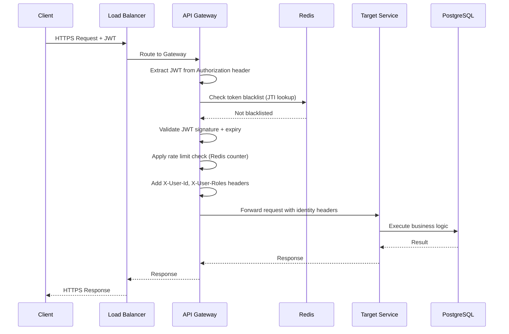

---

## 4. Authentication Flow

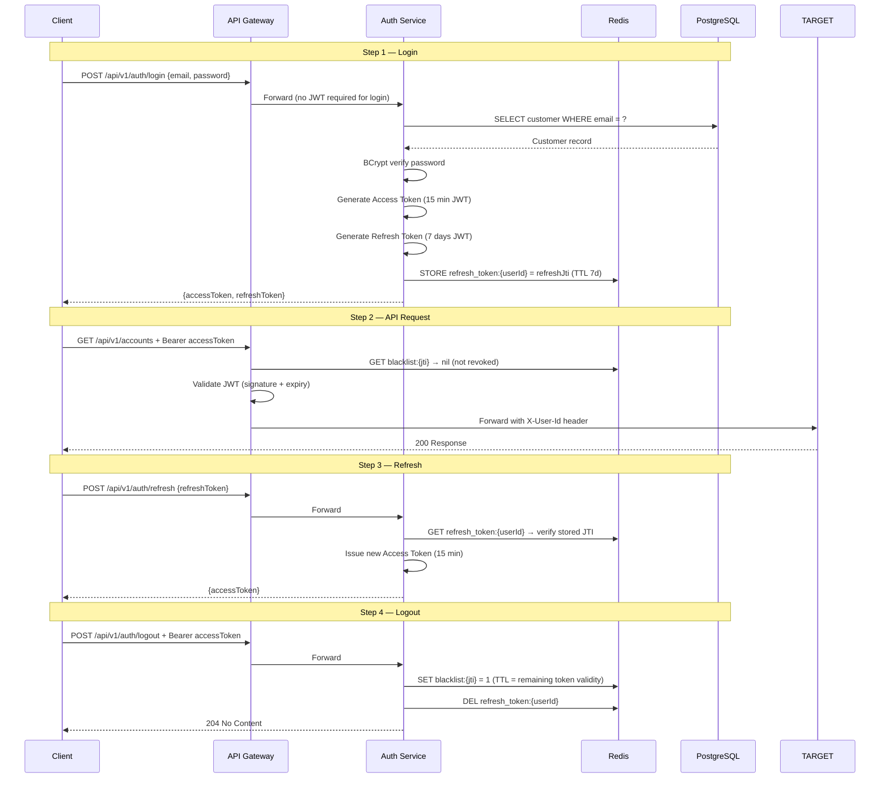

---

## 5. Transaction (Transfer) Flow

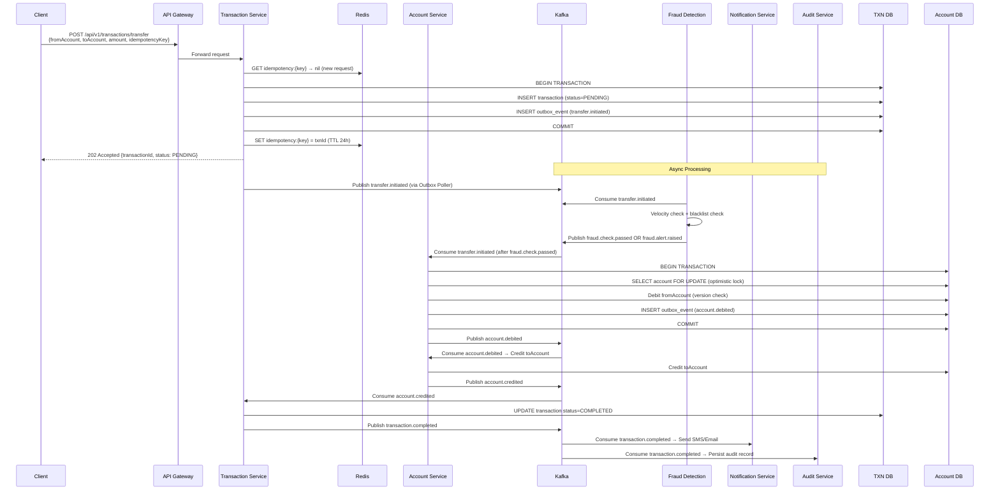

---

## 6. Fraud Detection Flow

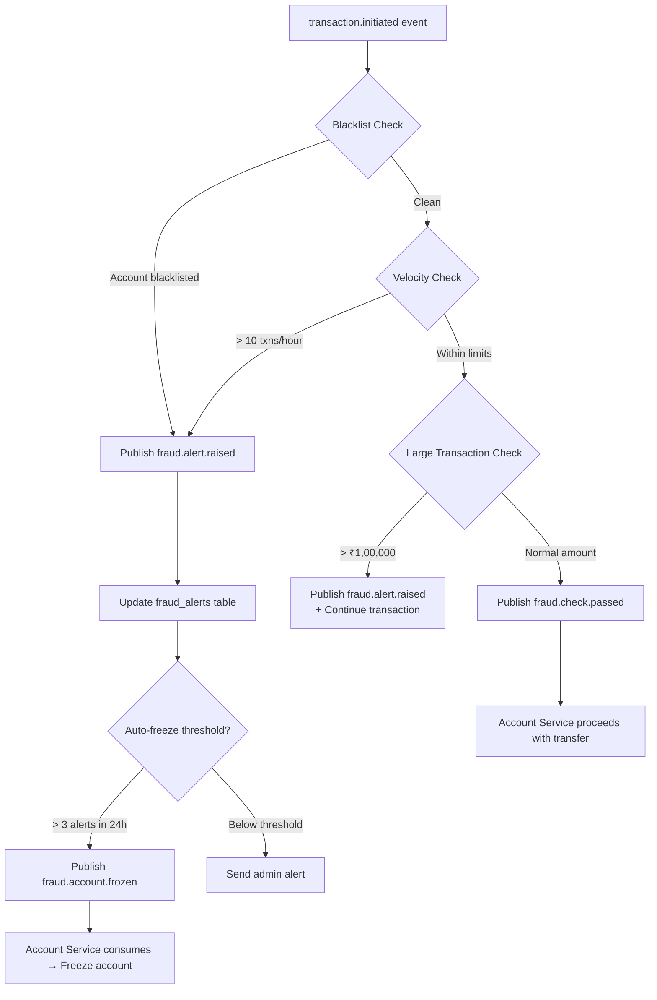

---

## 7. Notification Flow

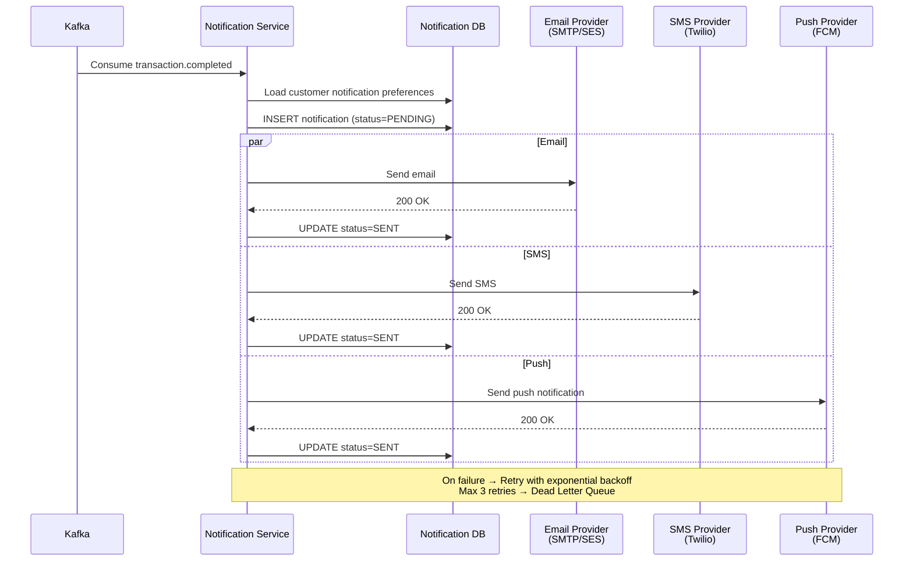

---

## 8. Event Flow (Kafka)

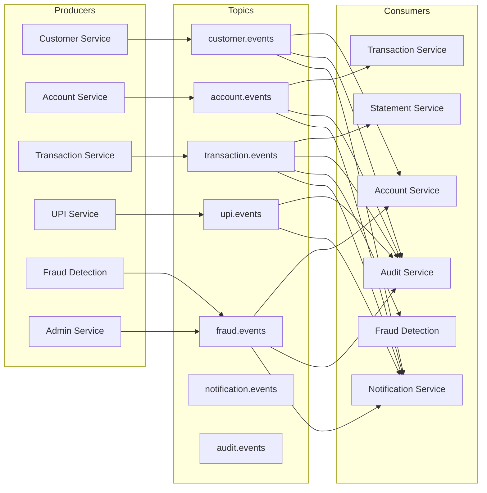

---

## 9. API Gateway Design

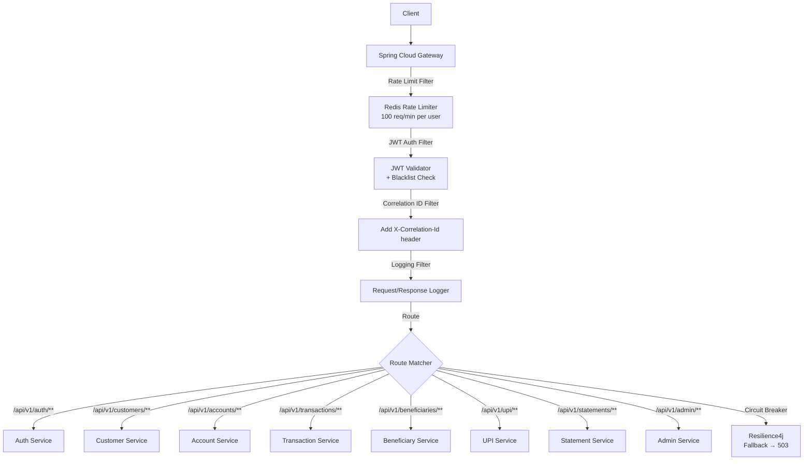

### Gateway Route Configuration

| Path Pattern | Target Service | Auth Required | Roles |
|-------------|---------------|---------------|-------|
| `/api/v1/auth/login` | Auth Service | No | Public |
| `/api/v1/auth/refresh` | Auth Service | No | Public |
| `/api/v1/customers/register` | Customer Service | No | Public |
| `/api/v1/customers/**` | Customer Service | Yes | CUSTOMER, ADMIN |
| `/api/v1/accounts/**` | Account Service | Yes | CUSTOMER, ADMIN |
| `/api/v1/transactions/**` | Transaction Service | Yes | CUSTOMER, ADMIN |
| `/api/v1/beneficiaries/**` | Beneficiary Service | Yes | CUSTOMER |
| `/api/v1/upi/**` | UPI Service | Yes | CUSTOMER |
| `/api/v1/statements/**` | Statement Service | Yes | CUSTOMER, ADMIN |
| `/api/v1/admin/**` | Admin Service | Yes | ADMIN, SUPER_ADMIN |

---

## 10. Caching Strategy

| Cache | Key Pattern | TTL | Service | Data |
|-------|------------|-----|---------|------|
| Account Balance | `balance:{accountId}` | 30 sec | Account Service | Current balance (read cache) |
| JWT Blacklist | `blacklist:{jti}` | Token remaining validity | Auth Service / Gateway | Revoked token JTI |
| Refresh Token | `refresh:{userId}` | 7 days | Auth Service | Refresh token JTI |
| OTP | `otp:{mobile}` | 5 min | Auth Service / Customer | One-time password |
| Idempotency | `idempotency:{key}` | 24 hours | Transaction / UPI Service | Request → Response mapping |
| Rate Limit | `ratelimit:{userId}:{window}` | 1 min | API Gateway | Request count |
| Customer Profile | `customer:{customerId}` | 10 min | Customer Service | Customer details |
| Blacklisted Accounts | `blacklist:accounts` | 5 min | Fraud Service | Set of account IDs |
| Daily UPI Limit | `upi:limit:{upiId}:{date}` | 24 hours | UPI Service | Amount used today |

---

## 11. Database Architecture

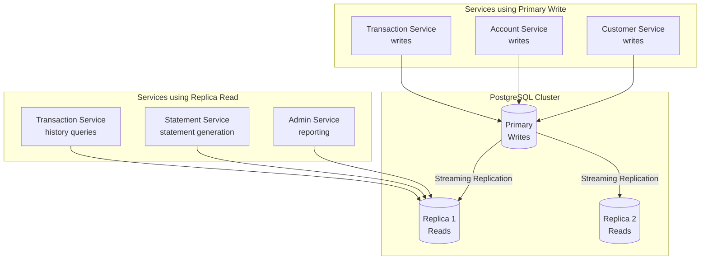

### Database Isolation Strategy
Each microservice owns its own **schema** within the shared PostgreSQL cluster (in development). In production, each service gets its own database instance for full isolation.

| Service | Schema (Dev) | Database (Prod) |
|---------|-------------|-----------------|
| Auth | `auth` | `auth_db` |
| Customer | `customer` | `customer_db` |
| Account | `account` | `account_db` |
| Transaction | `transaction` | `transaction_db` |
| Beneficiary | `beneficiary` | `beneficiary_db` |
| UPI | `upi` | `upi_db` |
| Fraud | `fraud` | `fraud_db` |
| Notification | `notification` | `notification_db` |
| Audit | `audit` | `audit_db` |

---

## 12. Network Architecture

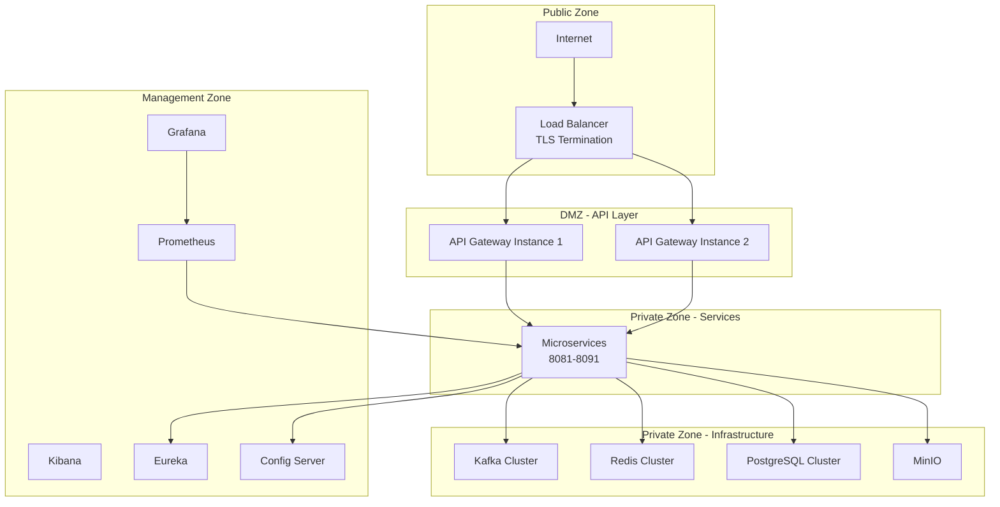

---

## 13. Scaling Strategy

### Horizontal Scaling

| Service | Scaling Trigger | Min Instances | Max Instances |
|---------|----------------|---------------|---------------|
| API Gateway | CPU > 70% | 2 | 10 |
| Transaction Service | Queue depth > 1000 | 2 | 20 |
| Account Service | CPU > 60% | 2 | 10 |
| Notification Service | Kafka lag > 5000 | 1 | 5 |
| Fraud Detection | Kafka lag > 1000 | 2 | 8 |
| Auth Service | RPS > 5000 | 2 | 8 |
| Customer Service | CPU > 70% | 2 | 6 |

### Database Scaling
- **Primary** handles all writes
- **Replicas** handle all reads (transaction history, statements, admin queries)
- **Connection pooling** via HikariCP (max 20 connections per service instance)
- **Future**: Citus PostgreSQL for horizontal sharding by account_id

### Kafka Scaling
- 3 brokers for high availability
- Topics partitioned by account ID (ensures ordering per account)
- Consumer group scaling: add consumers up to number of partitions

---

## 14. High Availability

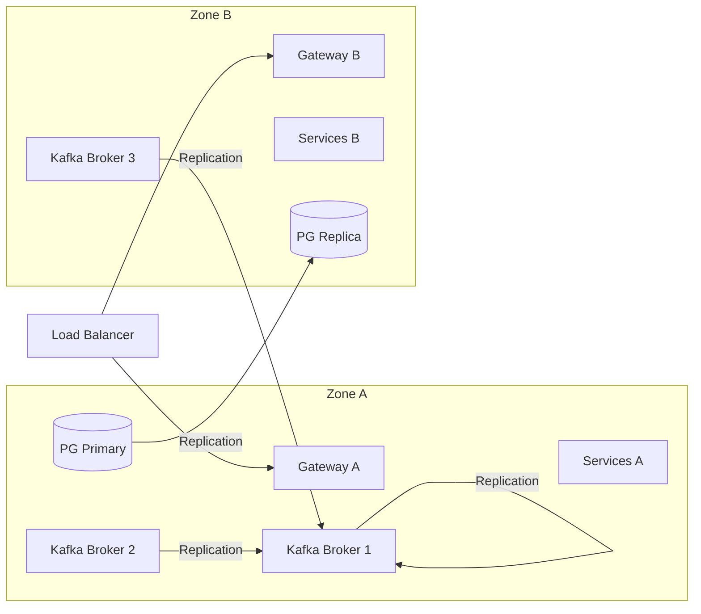

- **No single point of failure** — every component runs at least 2 instances
- **Kafka replication factor: 3** — data survives 2 broker failures
- **PostgreSQL streaming replication** — replica promoted in < 30 seconds on primary failure
- **Redis Cluster** — 3 master + 3 replica nodes; automatic failover

---

## 15. Fault Tolerance

| Component | Failure Mode | Recovery Mechanism |
|-----------|-------------|-------------------|
| API Gateway down | Client gets 502 | Load balancer routes to other gateway instance |
| Transaction Service down | Request fails | Client retries with same idempotency key; processing completes on recovery |
| Kafka broker down | Message publication fails | Outbox poller retries; Kafka replication ensures no data loss |
| PostgreSQL primary down | Write fails | Auto-failover to replica (< 30 sec); Flyway migrations re-applied |
| Redis down | Cache miss | Services fall back to database reads; no functional failure |
| Notification Service down | Notification delayed | Kafka retains event; notification sent when service recovers |
| Fraud Service down | Fraud check skipped | Configurable: block all transactions OR allow with post-hoc review |

### Circuit Breaker Configuration (Resilience4j)

```
Sliding window: 10 requests
Failure rate threshold: 50%
Wait duration in OPEN state: 30 seconds
Permitted calls in HALF_OPEN: 3
```

---

## 16. Disaster Recovery

| Scenario | RPO | RTO | Strategy |
|---------|-----|-----|----------|
| Single service crash | 0 (event-driven) | < 60 sec | Kubernetes restarts pod; Kafka replays events |
| Database primary failure | < 5 sec (replication lag) | < 30 sec | Automatic failover to replica |
| Kafka cluster failure | 0 (Outbox Pattern) | < 5 min | Restore from replicas; Outbox replays unpublished events |
| Data center failure | < 60 sec | < 15 min | Multi-AZ deployment; DNS failover |
| Accidental data deletion | 24 hours (backup) | < 2 hours | Restore from daily PostgreSQL backup (PITR) |

### Backup Strategy
- **PostgreSQL**: Daily full backup + WAL archiving (Point-In-Time Recovery)
- **Kafka**: 7-day message retention (replay on consumer failure)
- **Redis**: RDB snapshots every hour + AOF for critical data (tokens, OTPs)

---

## 17. Deployment Diagram

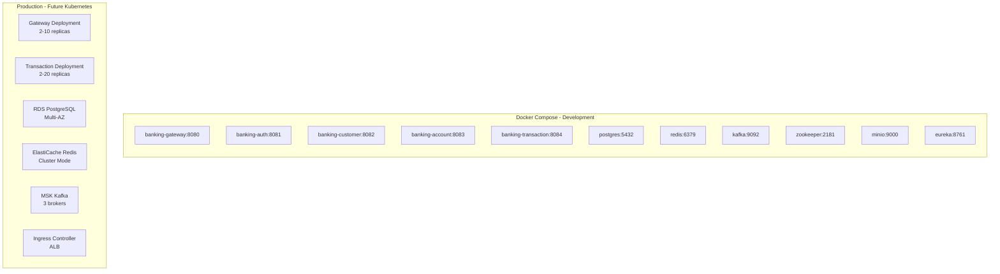

---

> **Next:** [Low Level Design →](04-LLD.md)
