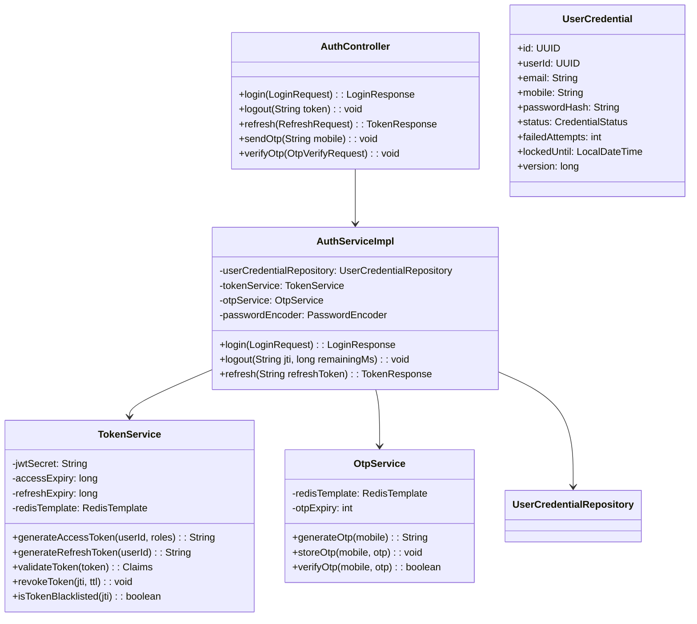
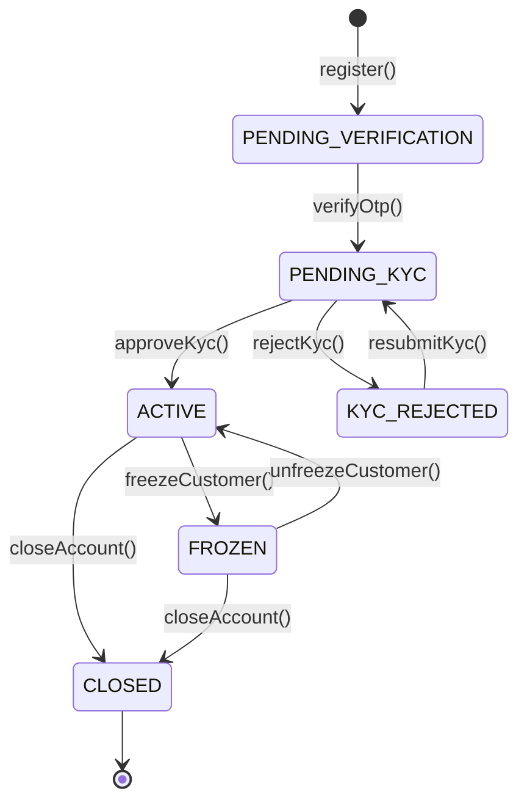
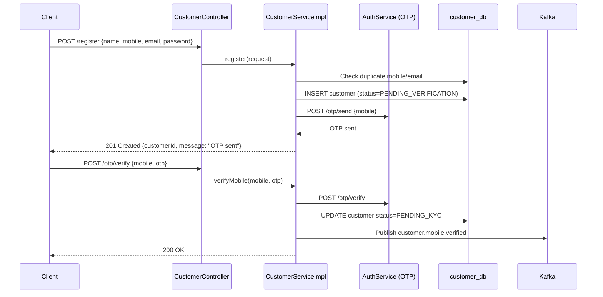
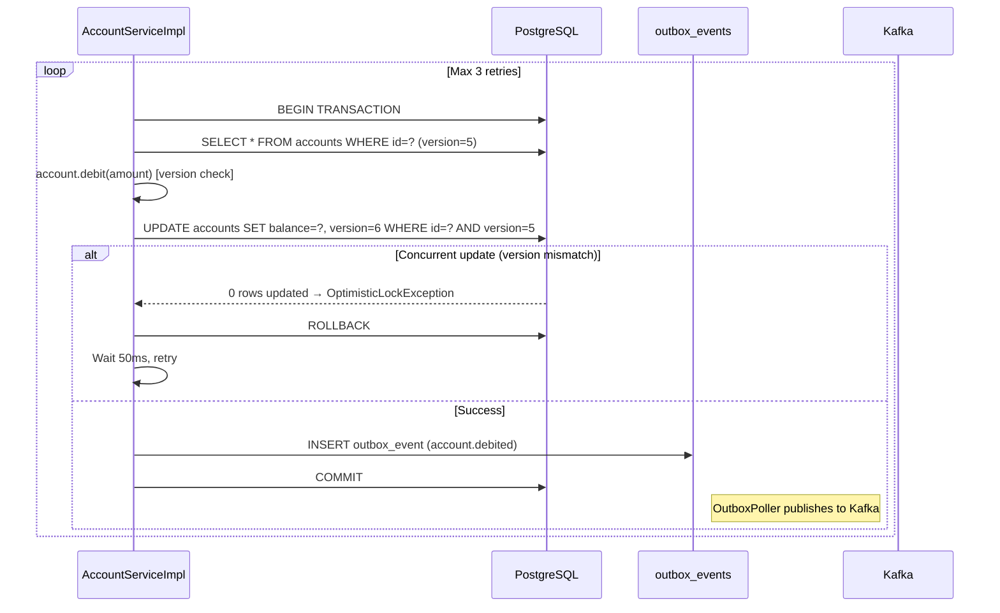
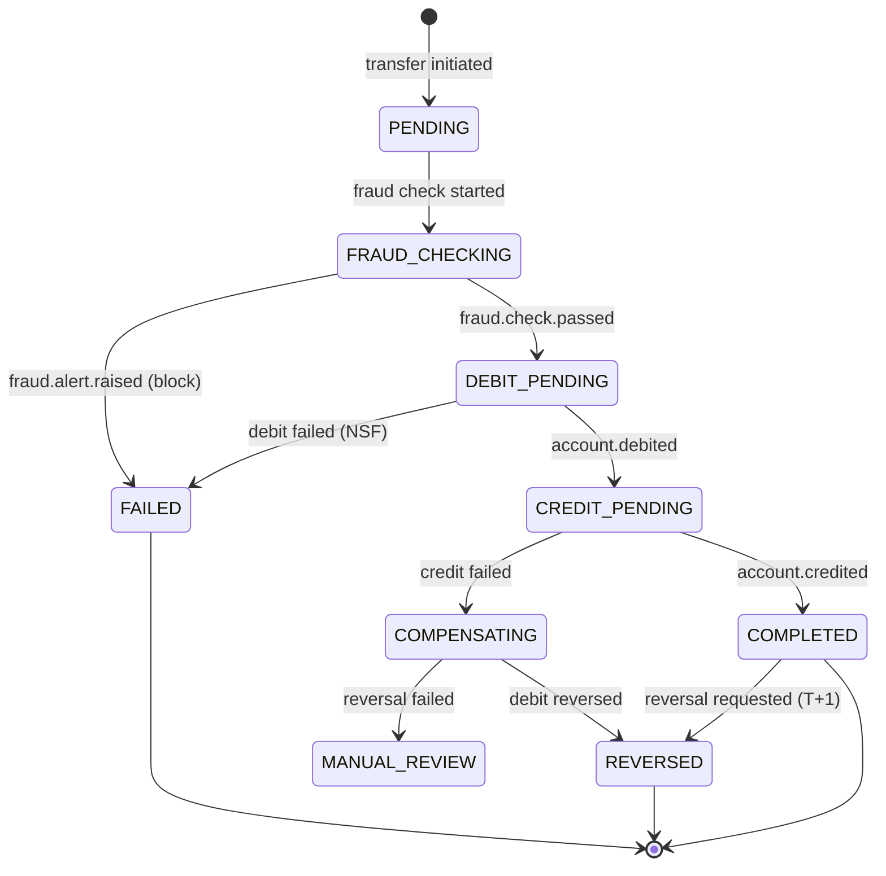
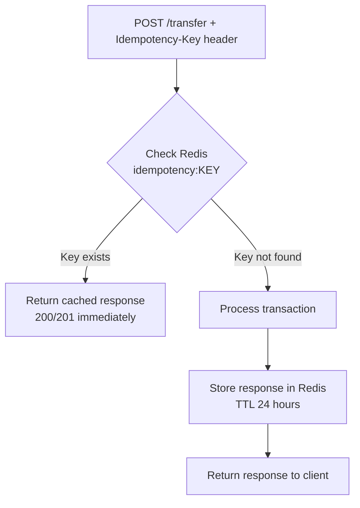
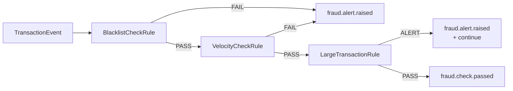

# 04 — Low Level Design (LLD)

> **Navigation:** [← HLD](03-HLD.md) | [Database Design →](05-Database-Design.md)

---

## Table of Contents

1. [Auth Service](#1-auth-service)
2. [Customer Service](#2-customer-service)
3. [Account Service](#3-account-service)
4. [Transaction Service](#4-transaction-service)
5. [Beneficiary Service](#5-beneficiary-service)
6. [UPI Service](#6-upi-service)
7. [Notification Service](#7-notification-service)
8. [Fraud Detection Service](#8-fraud-detection-service)
9. [Statement Service](#9-statement-service)
10. [Admin Service](#10-admin-service)
11. [Audit Service](#11-audit-service)
12. [Cross-Cutting Concerns](#12-cross-cutting-concerns)

---

## 1. Auth Service

### Responsibility
Issues, validates, and revokes JWT access tokens and refresh tokens. Handles login, logout, token refresh, and OTP-based verification.

### Package Structure
```
auth-service/
└── src/main/java/com/banking/auth/
    ├── AuthServiceApplication.java
    ├── config/
    │   ├── SecurityConfig.java          # Spring Security config (permit /login, /register)
    │   ├── JwtConfig.java               # JWT secret, expiry config
    │   └── RedisConfig.java             # Redis connection factory
    ├── controller/
    │   └── AuthController.java          # POST /login, /logout, /refresh, /otp/send, /otp/verify
    ├── service/
    │   ├── AuthService.java             # Interface
    │   ├── AuthServiceImpl.java         # Login, logout, refresh logic
    │   ├── OtpService.java              # OTP generation, storage, verification
    │   └── TokenService.java           # JWT creation, validation, revocation
    ├── repository/
    │   └── UserCredentialRepository.java
    ├── domain/
    │   ├── UserCredential.java          # JPA entity: userId, email, passwordHash, status
    │   └── TokenBlacklist.java          # (Redis, not DB)
    ├── dto/
    │   ├── request/
    │   │   ├── LoginRequest.java
    │   │   ├── RefreshRequest.java
    │   │   └── OtpVerifyRequest.java
    │   └── response/
    │       ├── LoginResponse.java       # {accessToken, refreshToken, expiresIn}
    │       └── TokenResponse.java
    ├── exception/
    │   ├── InvalidCredentialsException.java
    │   ├── TokenExpiredException.java
    │   └── GlobalExceptionHandler.java
    ├── filter/
    │   └── CorrelationIdFilter.java
    └── util/
        └── JwtUtil.java                 # sign, parse, extract claims
```

### Class Diagram



### JWT Claims Structure
```json
{
  "sub": "550e8400-e29b-41d4-a716-446655440000",
  "jti": "unique-jwt-id",
  "iat": 1700000000,
  "exp": 1700000900,
  "userId": "550e8400-e29b-41d4-a716-446655440000",
  "email": "customer@example.com",
  "roles": ["ROLE_CUSTOMER"],
  "accountIds": ["ACC001", "ACC002"]
}
```

---

## 2. Customer Service

### Responsibility
Manages customer lifecycle: registration, KYC, profile updates, and account freezing.

### Package Structure
```
customer-service/
└── src/main/java/com/banking/customer/
    ├── CustomerServiceApplication.java
    ├── config/
    │   ├── SecurityConfig.java
    │   └── KafkaProducerConfig.java
    ├── controller/
    │   └── CustomerController.java      # POST /register, GET /{id}, PUT /{id}, POST /{id}/kyc, POST /{id}/freeze
    ├── service/
    │   ├── CustomerService.java
    │   ├── CustomerServiceImpl.java
    │   └── KycService.java
    ├── repository/
    │   ├── CustomerRepository.java
    │   └── KycRepository.java
    ├── domain/
    │   ├── Customer.java                # JPA entity
    │   ├── CustomerKyc.java             # JPA entity
    │   └── enums/
    │       ├── CustomerStatus.java      # ACTIVE, FROZEN, CLOSED, PENDING_KYC
    │       └── KycStatus.java           # PENDING, APPROVED, REJECTED
    ├── dto/
    │   ├── request/
    │   │   ├── CustomerRegistrationRequest.java
    │   │   ├── CustomerUpdateRequest.java
    │   │   └── KycSubmissionRequest.java
    │   └── response/
    │       └── CustomerResponse.java
    ├── event/
    │   ├── CustomerEventPublisher.java  # Publishes to customer.events topic
    │   └── events/
    │       ├── CustomerRegisteredEvent.java
    │       ├── CustomerKycApprovedEvent.java
    │       └── CustomerFrozenEvent.java
    ├── mapper/
    │   └── CustomerMapper.java          # Entity ↔ DTO (MapStruct)
    ├── validator/
    │   └── CustomerValidator.java       # PAN format, mobile format validation
    └── exception/
        ├── CustomerNotFoundException.java
        ├── DuplicateCustomerException.java
        └── GlobalExceptionHandler.java
```

### State Machine — Customer Status



### Sequence — Customer Registration



---

## 3. Account Service

### Responsibility
Manages account lifecycle, balance inquiries, and balance updates. Uses optimistic locking for concurrent balance modifications.

### Package Structure
```
account-service/
└── src/main/java/com/banking/account/
    ├── config/
    │   ├── KafkaConfig.java             # Producer + Consumer config
    │   └── RedisConfig.java
    ├── controller/
    │   └── AccountController.java       # POST /, GET /{id}/balance, POST /{id}/freeze, DELETE /{id}
    ├── service/
    │   ├── AccountService.java
    │   ├── AccountServiceImpl.java
    │   └── BalanceCacheService.java     # Redis balance cache read/write
    ├── repository/
    │   └── AccountRepository.java
    ├── domain/
    │   ├── Account.java                 # JPA entity with @Version
    │   └── enums/
    │       ├── AccountType.java         # SAVINGS, CURRENT, FIXED_DEPOSIT
    │       └── AccountStatus.java       # ACTIVE, FROZEN, CLOSED
    ├── event/
    │   ├── AccountEventPublisher.java
    │   └── consumer/
    │       └── CustomerEventConsumer.java  # Consumes customer.kyc.approved → auto-create account
    ├── outbox/
    │   ├── OutboxEvent.java             # JPA entity
    │   ├── OutboxRepository.java
    │   └── OutboxPoller.java            # @Scheduled: reads unpublished events, publishes to Kafka
    └── exception/
        ├── InsufficientFundsException.java
        ├── AccountFrozenException.java
        └── AccountNotFoundException.java
```

### Account Entity with Optimistic Locking

```java
@Entity
@Table(name = "accounts")
public class Account {
    @Id
    private UUID id;
    private String accountNumber;
    private UUID customerId;
    private BigDecimal balance;
    private AccountType type;
    private AccountStatus status;
    
    @Version                             // Optimistic locking version field
    private long version;
    
    private LocalDateTime createdAt;
    private LocalDateTime updatedAt;
    
    public void debit(BigDecimal amount) {
        if (status == AccountStatus.FROZEN)
            throw new AccountFrozenException(id);
        if (balance.compareTo(amount) < 0)
            throw new InsufficientFundsException(id, amount, balance);
        this.balance = this.balance.subtract(amount);
    }
    
    public void credit(BigDecimal amount) {
        if (status == AccountStatus.FROZEN)
            throw new AccountFrozenException(id);
        this.balance = this.balance.add(amount);
    }
}
```

### Sequence — Balance Debit with Optimistic Lock Retry



---

## 4. Transaction Service

### Responsibility
Orchestrates fund transfers using the Saga pattern. Maintains transaction records with idempotency. Uses Outbox pattern for guaranteed event delivery.

### Package Structure
```
transaction-service/
└── src/main/java/com/banking/transaction/
    ├── controller/
    │   └── TransactionController.java   # POST /deposit, /withdraw, /transfer, GET /{id}, GET /history
    ├── service/
    │   ├── TransactionService.java
    │   ├── TransactionServiceImpl.java
    │   └── IdempotencyService.java      # Redis-based idempotency check
    ├── repository/
    │   ├── TransactionRepository.java
    │   └── TransactionReadRepository.java  # Read replica queries
    ├── domain/
    │   ├── Transaction.java
    │   └── enums/
    │       ├── TransactionType.java     # DEPOSIT, WITHDRAWAL, TRANSFER, REVERSAL
    │       └── TransactionStatus.java   # PENDING, COMPLETED, FAILED, REVERSED
    ├── saga/
    │   └── TransferSagaCoordinator.java # Publishes saga events, handles compensation
    ├── event/
    │   ├── TransactionEventPublisher.java
    │   └── consumer/
    │       ├── AccountEventConsumer.java   # Consumes account.debited, account.credited
    │       └── FraudEventConsumer.java     # Consumes fraud.alert.raised → fail transaction
    ├── outbox/
    │   ├── OutboxEvent.java
    │   ├── OutboxRepository.java
    │   └── OutboxPoller.java
    └── exception/
        ├── TransactionNotFoundException.java
        ├── DuplicateTransactionException.java
        └── TransactionFailedException.java
```

### Transaction State Machine



### Idempotency Flow



---

## 5. Beneficiary Service

### Responsibility
Manages trusted payees (beneficiaries) for a customer. Enforces a cooldown period before first transfer. Penny-drop verification via UPI.

### Package Structure
```
beneficiary-service/
└── src/main/java/com/banking/beneficiary/
    ├── controller/
    │   └── BeneficiaryController.java   # POST /, DELETE /{id}, GET /, GET /{id}/verify
    ├── service/
    │   ├── BeneficiaryService.java
    │   ├── BeneficiaryServiceImpl.java
    │   └── PennyDropService.java        # Penny-drop verification via UPI Service
    ├── repository/
    │   └── BeneficiaryRepository.java
    ├── domain/
    │   ├── Beneficiary.java
    │   └── enums/
    │       └── BeneficiaryStatus.java   # PENDING_VERIFICATION, ACTIVE, REMOVED
    ├── validator/
    │   └── IFSCValidator.java
    └── exception/
        ├── BeneficiaryNotFoundException.java
        ├── MaxBeneficiaryLimitException.java
        └── BeneficiaryCooldownException.java
```

### Beneficiary Cooldown Logic
```
ADD beneficiary → status = PENDING_VERIFICATION
    → Penny-drop ₹1 transfer via UPI
    → If success: status = ACTIVE, transfer_enabled_at = now + 24 hours
    → First transfer allowed only after transfer_enabled_at
```

---

## 6. UPI Service

### Responsibility
Manages UPI Virtual Payment Addresses (VPA), PIN management, UPI transfers, and daily limits.

### Package Structure
```
upi-service/
└── src/main/java/com/banking/upi/
    ├── controller/
    │   └── UpiController.java           # POST /create, PUT /{id}/pin, POST /transfer, GET /history
    ├── service/
    │   ├── UpiService.java
    │   ├── UpiServiceImpl.java
    │   └── DailyLimitService.java       # Redis-backed daily limit tracking
    ├── repository/
    │   ├── UpiIdRepository.java
    │   └── UpiTransactionRepository.java
    ├── domain/
    │   ├── UpiId.java                   # VPA, accountId, pin hash, status, dailyLimit
    │   ├── UpiTransaction.java
    │   └── enums/
    │       └── UpiStatus.java           # ACTIVE, BLOCKED, DEACTIVATED
    ├── event/
    │   └── UpiEventPublisher.java
    └── security/
        └── UpiPinEncryptor.java         # AES-256 PIN encryption
```

### Daily Limit Enforcement (Redis)
```
Key: upi:limit:{upiId}:{YYYY-MM-DD}
Type: String (BigDecimal as string)
TTL: Expires at midnight

On each transfer:
  current = INCRBYFLOAT upi:limit:{id}:{today} amount
  if current > dailyLimit → throw DailyLimitExceededException
```

---

## 7. Notification Service

### Responsibility
Consumes all domain events from Kafka and sends Email, SMS, and Push notifications based on customer preferences.

### Package Structure
```
notification-service/
└── src/main/java/com/banking/notification/
    ├── consumer/
    │   ├── TransactionEventConsumer.java
    │   ├── AccountEventConsumer.java
    │   ├── CustomerEventConsumer.java
    │   └── FraudEventConsumer.java
    ├── service/
    │   ├── NotificationService.java
    │   ├── EmailNotificationService.java    # JavaMailSender / AWS SES
    │   ├── SmsNotificationService.java      # Twilio REST client
    │   └── PushNotificationService.java     # Firebase FCM
    ├── repository/
    │   ├── NotificationRepository.java
    │   └── NotificationPreferenceRepository.java
    ├── domain/
    │   ├── Notification.java               # status, channel, retryCount, sentAt
    │   └── NotificationPreference.java     # email/sms/push enabled per customer
    ├── template/
    │   ├── EmailTemplateEngine.java        # Thymeleaf templates
    │   └── templates/
    │       ├── transaction-alert.html
    │       └── account-frozen.html
    ├── retry/
    │   └── NotificationRetryHandler.java   # Exponential backoff, max 3 retries
    └── scheduler/
        └── FailedNotificationRetryScheduler.java  # @Scheduled: retry FAILED notifications
```

### Notification Retry Strategy
```
Attempt 1: Immediate
Attempt 2: +30 seconds
Attempt 3: +5 minutes
After 3 failures → status = DEAD_LETTER → admin alert
```

---

## 8. Fraud Detection Service

### Responsibility
Consumes `transaction.initiated` events and applies rule-based fraud checks. Publishes results back to Kafka.

### Package Structure
```
fraud-detection-service/
└── src/main/java/com/banking/fraud/
    ├── consumer/
    │   └── TransactionEventConsumer.java
    ├── service/
    │   ├── FraudDetectionService.java
    │   └── FraudDetectionServiceImpl.java
    ├── rules/
    │   ├── FraudRule.java                  # Interface: evaluate(TransactionEvent) → RuleResult
    │   ├── VelocityCheckRule.java          # > 10 txns/hour → FRAUD
    │   ├── BlacklistCheckRule.java         # Account in blacklist → FRAUD
    │   ├── LargeTransactionRule.java       # > ₹1,00,000 → ALERT (not block)
    │   └── FraudRuleChain.java             # Chain of responsibility: applies all rules in order
    ├── repository/
    │   ├── FraudAlertRepository.java
    │   └── BlacklistedAccountRepository.java
    ├── domain/
    │   ├── FraudAlert.java
    │   └── BlacklistedAccount.java
    ├── cache/
    │   └── BlacklistCacheService.java      # Redis-backed blacklist lookup
    └── event/
        └── FraudEventPublisher.java
```

### Fraud Rule Chain (Chain of Responsibility Pattern)



### Velocity Check Logic (Redis)
```
Key: velocity:{accountId}:{hour_bucket}
Type: Sorted Set (score = timestamp, member = txnId)
TTL: 1 hour

On each transaction:
  ZADD velocity:{accountId}:{bucket} timestamp txnId
  count = ZCARD velocity:{accountId}:{bucket}
  if count > VELOCITY_THRESHOLD → FRAUD
```

---

## 9. Statement Service

### Responsibility
Consumes transaction events to build statement data. Generates PDF statements on request. Stores PDFs in MinIO/S3.

### Package Structure
```
statement-service/
└── src/main/java/com/banking/statement/
    ├── controller/
    │   └── StatementController.java     # GET /{accountId}/monthly, GET /{accountId}/download
    ├── consumer/
    │   └── TransactionEventConsumer.java  # Builds read model from events
    ├── service/
    │   ├── StatementService.java
    │   ├── StatementServiceImpl.java
    │   └── PdfGenerationService.java    # iText / Apache PDFBox
    ├── repository/
    │   └── StatementRepository.java     # Read replica
    ├── storage/
    │   └── MinioStorageService.java     # Upload/download PDFs
    ├── domain/
    │   └── Statement.java              # month, accountId, s3Key, generatedAt
    └── scheduler/
        └── MonthlyStatementScheduler.java  # @Scheduled: 1st of each month, generate for all accounts
```

---

## 10. Admin Service

### Responsibility
Internal-only service for bank operations staff. Queries read replicas. Publishes freeze/unfreeze events.

### Package Structure
```
admin-service/
└── src/main/java/com/banking/admin/
    ├── controller/
    │   ├── CustomerAdminController.java     # GET /customers, POST /customers/{id}/freeze
    │   ├── AccountAdminController.java      # GET /accounts, POST /accounts/{id}/freeze
    │   ├── TransactionAdminController.java  # GET /transactions (filtered)
    │   └── FraudAdminController.java        # GET /fraud-alerts, POST /fraud-alerts/{id}/resolve
    ├── service/
    │   └── AdminService.java
    ├── security/
    │   └── AdminSecurityConfig.java         # Require ROLE_ADMIN for all /admin/** routes
    └── dto/
        └── FraudDashboardResponse.java
```

### Admin RBAC Roles

| Role | Permissions |
|------|------------|
| `ROLE_SUPER_ADMIN` | All operations including role assignment |
| `ROLE_ADMIN` | Freeze/unfreeze accounts, approve KYC, view all |
| `ROLE_OPS` | View customers, transactions; no freeze capability |
| `ROLE_AUDITOR` | Read-only access to all data including audit logs |

---

## 11. Audit Service

### Responsibility
Consumes all domain events and writes immutable audit records. Never deletes or updates records. WORM (Write Once Read Many) semantics.

### Package Structure
```
audit-service/
└── src/main/java/com/banking/audit/
    ├── consumer/
    │   └── AllEventConsumer.java        # Subscribes to all topics via pattern
    ├── service/
    │   └── AuditService.java
    ├── repository/
    │   └── AuditLogRepository.java
    ├── domain/
    │   └── AuditLog.java               # eventType, entityType, entityId, payload, performedBy, timestamp
    └── config/
        └── KafkaConsumerConfig.java     # Group ID: audit-service
```

### Audit Log Entry Structure
```json
{
  "id": "uuid",
  "eventType": "transaction.completed",
  "entityType": "TRANSACTION",
  "entityId": "txn-uuid",
  "performedBy": "customer-uuid",
  "ipAddress": "192.168.1.1",
  "payload": { "amount": 5000, "fromAccount": "ACC001", "toAccount": "ACC002" },
  "timestamp": "2026-08-15T10:30:00Z",
  "correlationId": "req-uuid"
}
```

---

## 12. Cross-Cutting Concerns

### 12.1 Correlation ID Filter (all services)
Every inbound request receives an `X-Correlation-Id` header (generated at Gateway if absent). All service logs include this ID for distributed tracing.

```java
@Component
public class CorrelationIdFilter implements Filter {
    public void doFilter(ServletRequest req, ServletResponse res, FilterChain chain) {
        String correlationId = Optional.ofNullable(
            ((HttpServletRequest) req).getHeader("X-Correlation-Id")
        ).orElse(UUID.randomUUID().toString());
        
        MDC.put("correlationId", correlationId);
        ((HttpServletResponse) res).setHeader("X-Correlation-Id", correlationId);
        chain.doFilter(req, res);
        MDC.clear();
    }
}
```

### 12.2 Global Exception Handler

```java
@RestControllerAdvice
public class GlobalExceptionHandler {
    
    @ExceptionHandler(EntityNotFoundException.class)
    public ResponseEntity<ErrorResponse> handleNotFound(EntityNotFoundException ex) {
        return ResponseEntity.status(404).body(new ErrorResponse("NOT_FOUND", ex.getMessage()));
    }
    
    @ExceptionHandler(ValidationException.class)
    public ResponseEntity<ErrorResponse> handleValidation(ValidationException ex) {
        return ResponseEntity.status(400).body(new ErrorResponse("VALIDATION_ERROR", ex.getMessage()));
    }
    
    @ExceptionHandler(InsufficientFundsException.class)
    public ResponseEntity<ErrorResponse> handleNSF(InsufficientFundsException ex) {
        return ResponseEntity.status(422).body(new ErrorResponse("INSUFFICIENT_FUNDS", ex.getMessage()));
    }
}
```

### 12.3 Structured Logging Format (JSON)
```json
{
  "timestamp": "2026-08-15T10:30:00.000Z",
  "level": "INFO",
  "service": "transaction-service",
  "correlationId": "req-uuid",
  "userId": "customer-uuid",
  "message": "Transfer initiated",
  "transactionId": "txn-uuid",
  "amount": 5000,
  "fromAccount": "ACC001",
  "toAccount": "ACC002"
}
```

### 12.4 Outbox Poller (shared component)

```java
@Component
public class OutboxPoller {
    
    @Scheduled(fixedDelay = 100)  // Poll every 100ms
    @Transactional
    public void pollAndPublish() {
        List<OutboxEvent> events = outboxRepository
            .findTopByPublishedFalseOrderByCreatedAtAsc(100,
                new ForUpdateSkipLocked());  // SELECT FOR UPDATE SKIP LOCKED
        
        for (OutboxEvent event : events) {
            kafkaTemplate.send(event.getTopic(), event.getAggregateId(), event.getPayload());
            event.setPublished(true);
            outboxRepository.save(event);
        }
    }
}
```

### 12.5 Transaction Management Strategy

- All write operations annotated with `@Transactional(isolation = READ_COMMITTED)`
- Read operations use `@Transactional(readOnly = true)` for connection pool optimization
- Outbox events written in the **same transaction** as the domain entity change

### 12.6 API Versioning
All APIs are versioned in the URL path: `/api/v1/`, `/api/v2/`  
Old versions maintained for 6 months after deprecation announcement.

---

> **Next:** [Database Design →](05-Database-Design.md)
