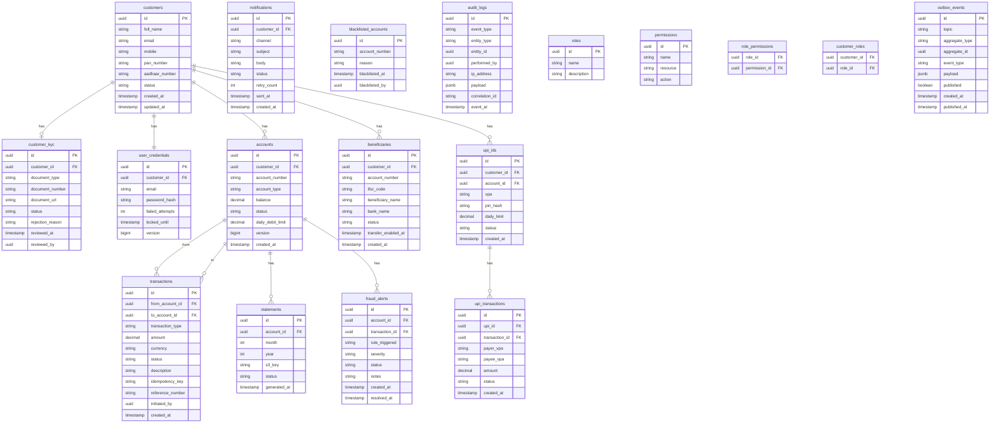

# 05 — Database Design

> **Navigation:** [← LLD](04-LLD.md) | [API Design →](06-API-Design.md)

---

## Table of Contents

1. [Design Principles](#1-design-principles)
2. [Entity Relationship Diagram](#2-entity-relationship-diagram)
3. [Table Definitions](#3-table-definitions)
4. [Indexes](#4-indexes)
5. [Sample Data](#5-sample-data)

---

## 1. Design Principles

- **Normalization**: 3NF for all transactional tables; selective denormalization only for audit/read-model tables
- **UUID Primary Keys**: All tables use UUID primary keys (`gen_random_uuid()`) for distributed generation without coordination
- **Soft Deletes**: No hard deletes in financial tables; use `status` columns and `deleted_at` timestamps
- **Audit Columns**: Every table has `created_at`, `updated_at`
- **Optimistic Locking**: Account table has `version` column for concurrent balance updates
- **Immutable Records**: `transactions` and `audit_logs` tables are append-only; no updates except status transitions
- **Schema Isolation**: Each microservice owns its own PostgreSQL schema; services never cross-query schemas

---

## 2. Entity Relationship Diagram



---

## 3. Table Definitions

### 3.1 customers

```sql
CREATE TABLE customers (
    id              UUID PRIMARY KEY DEFAULT gen_random_uuid(),
    full_name       VARCHAR(100) NOT NULL,
    email           VARCHAR(150) NOT NULL UNIQUE,
    mobile          VARCHAR(15)  NOT NULL UNIQUE,
    date_of_birth   DATE,
    gender          VARCHAR(10),
    address_line1   VARCHAR(255),
    address_line2   VARCHAR(255),
    city            VARCHAR(100),
    state           VARCHAR(100),
    pincode         VARCHAR(10),
    pan_number      VARCHAR(10)  UNIQUE,
    aadhaar_number  VARCHAR(12)  UNIQUE,
    status          VARCHAR(30)  NOT NULL DEFAULT 'PENDING_VERIFICATION'
                    CHECK (status IN ('PENDING_VERIFICATION','PENDING_KYC','ACTIVE','FROZEN','CLOSED','KYC_REJECTED')),
    created_at      TIMESTAMP NOT NULL DEFAULT NOW(),
    updated_at      TIMESTAMP NOT NULL DEFAULT NOW()
);

COMMENT ON TABLE customers IS 'Core customer identity table. No PII deletion — anonymization on account closure.';
COMMENT ON COLUMN customers.aadhaar_number IS 'Last 4 digits stored masked; full number encrypted separately.';
```

### 3.2 customer_kyc

```sql
CREATE TABLE customer_kyc (
    id                UUID PRIMARY KEY DEFAULT gen_random_uuid(),
    customer_id       UUID NOT NULL REFERENCES customers(id),
    document_type     VARCHAR(50)  NOT NULL CHECK (document_type IN ('AADHAAR','PAN','PASSPORT','VOTER_ID','DRIVING_LICENSE')),
    document_number   VARCHAR(50)  NOT NULL,
    document_url      VARCHAR(500) NOT NULL,   -- S3 URL (encrypted)
    status            VARCHAR(20)  NOT NULL DEFAULT 'PENDING'
                      CHECK (status IN ('PENDING','APPROVED','REJECTED')),
    rejection_reason  VARCHAR(500),
    reviewed_at       TIMESTAMP,
    reviewed_by       UUID,                    -- Admin user ID
    created_at        TIMESTAMP NOT NULL DEFAULT NOW()
);
```

### 3.3 user_credentials

```sql
CREATE TABLE user_credentials (
    id              UUID PRIMARY KEY DEFAULT gen_random_uuid(),
    customer_id     UUID NOT NULL REFERENCES customers(id) UNIQUE,
    email           VARCHAR(150) NOT NULL UNIQUE,
    password_hash   VARCHAR(255) NOT NULL,     -- BCrypt hash
    failed_attempts INT NOT NULL DEFAULT 0,
    locked_until    TIMESTAMP,
    status          VARCHAR(20) NOT NULL DEFAULT 'ACTIVE'
                    CHECK (status IN ('ACTIVE','LOCKED','DISABLED')),
    version         BIGINT NOT NULL DEFAULT 0, -- Optimistic lock
    created_at      TIMESTAMP NOT NULL DEFAULT NOW(),
    updated_at      TIMESTAMP NOT NULL DEFAULT NOW()
);
```

### 3.4 accounts

```sql
CREATE TABLE accounts (
    id                  UUID PRIMARY KEY DEFAULT gen_random_uuid(),
    customer_id         UUID NOT NULL REFERENCES customers(id),
    account_number      VARCHAR(20) NOT NULL UNIQUE,  -- Generated: YYYYMMDD + 8 random digits
    account_type        VARCHAR(20) NOT NULL CHECK (account_type IN ('SAVINGS','CURRENT','FIXED_DEPOSIT')),
    balance             DECIMAL(18,2) NOT NULL DEFAULT 0.00
                        CHECK (balance >= 0),
    currency            CHAR(3) NOT NULL DEFAULT 'INR',
    status              VARCHAR(20) NOT NULL DEFAULT 'ACTIVE'
                        CHECK (status IN ('ACTIVE','FROZEN','CLOSED')),
    freeze_reason       VARCHAR(255),
    daily_debit_limit   DECIMAL(18,2) DEFAULT 100000.00,
    minimum_balance     DECIMAL(18,2) DEFAULT 1000.00,
    ifsc_code           VARCHAR(20) NOT NULL DEFAULT 'BANK0000001',
    branch_code         VARCHAR(10),
    version             BIGINT NOT NULL DEFAULT 0,    -- Optimistic lock
    created_at          TIMESTAMP NOT NULL DEFAULT NOW(),
    updated_at          TIMESTAMP NOT NULL DEFAULT NOW(),
    closed_at           TIMESTAMP
);
```

### 3.5 transactions

```sql
CREATE TABLE transactions (
    id                  UUID PRIMARY KEY DEFAULT gen_random_uuid(),
    from_account_id     UUID REFERENCES accounts(id),  -- NULL for deposits
    to_account_id       UUID REFERENCES accounts(id),  -- NULL for withdrawals
    transaction_type    VARCHAR(20) NOT NULL 
                        CHECK (transaction_type IN ('DEPOSIT','WITHDRAWAL','TRANSFER','UPI_TRANSFER','REVERSAL')),
    amount              DECIMAL(18,2) NOT NULL CHECK (amount > 0),
    currency            CHAR(3) NOT NULL DEFAULT 'INR',
    status              VARCHAR(20) NOT NULL DEFAULT 'PENDING'
                        CHECK (status IN ('PENDING','FRAUD_CHECKING','DEBIT_PENDING','CREDIT_PENDING',
                                          'COMPLETED','FAILED','REVERSED','MANUAL_REVIEW')),
    description         VARCHAR(255),
    idempotency_key     VARCHAR(64) UNIQUE,
    reference_number    VARCHAR(50) UNIQUE,             -- External reference (IMPS/NEFT ref)
    reversal_of         UUID REFERENCES transactions(id),  -- For reversal transactions
    failure_reason      VARCHAR(255),
    initiated_by        UUID NOT NULL,                  -- customer_id
    ip_address          VARCHAR(45),
    channel             VARCHAR(20) DEFAULT 'API'
                        CHECK (channel IN ('API','MOBILE','WEB','BRANCH','ATM')),
    created_at          TIMESTAMP NOT NULL DEFAULT NOW(),
    updated_at          TIMESTAMP NOT NULL DEFAULT NOW(),
    completed_at        TIMESTAMP
);

COMMENT ON TABLE transactions IS 'Append-only transaction ledger. No deletes. Status transitions tracked via updated_at.';
```

### 3.6 beneficiaries

```sql
CREATE TABLE beneficiaries (
    id                   UUID PRIMARY KEY DEFAULT gen_random_uuid(),
    customer_id          UUID NOT NULL REFERENCES customers(id),
    account_number       VARCHAR(20) NOT NULL,
    ifsc_code            VARCHAR(20) NOT NULL,
    beneficiary_name     VARCHAR(100) NOT NULL,
    bank_name            VARCHAR(100),
    nick_name            VARCHAR(50),
    status               VARCHAR(30) NOT NULL DEFAULT 'PENDING_VERIFICATION'
                         CHECK (status IN ('PENDING_VERIFICATION','ACTIVE','REMOVED')),
    transfer_enabled_at  TIMESTAMP,                    -- Cooldown enforced
    penny_drop_txn_id    UUID,                         -- Transaction ID of penny drop
    created_at           TIMESTAMP NOT NULL DEFAULT NOW(),
    removed_at           TIMESTAMP,
    UNIQUE (customer_id, account_number, ifsc_code)
);
```

### 3.7 upi_ids

```sql
CREATE TABLE upi_ids (
    id              UUID PRIMARY KEY DEFAULT gen_random_uuid(),
    customer_id     UUID NOT NULL REFERENCES customers(id),
    account_id      UUID NOT NULL REFERENCES accounts(id),
    vpa             VARCHAR(100) NOT NULL UNIQUE,      -- e.g., customer@bankname
    pin_hash        VARCHAR(255) NOT NULL,              -- BCrypt hashed 6-digit PIN
    daily_limit     DECIMAL(18,2) DEFAULT 100000.00,
    status          VARCHAR(20) NOT NULL DEFAULT 'ACTIVE'
                    CHECK (status IN ('ACTIVE','BLOCKED','DEACTIVATED')),
    created_at      TIMESTAMP NOT NULL DEFAULT NOW(),
    deactivated_at  TIMESTAMP
);
```

### 3.8 upi_transactions

```sql
CREATE TABLE upi_transactions (
    id              UUID PRIMARY KEY DEFAULT gen_random_uuid(),
    upi_id          UUID NOT NULL REFERENCES upi_ids(id),
    transaction_id  UUID NOT NULL REFERENCES transactions(id),
    payer_vpa       VARCHAR(100) NOT NULL,
    payee_vpa       VARCHAR(100) NOT NULL,
    amount          DECIMAL(18,2) NOT NULL,
    remarks         VARCHAR(255),
    status          VARCHAR(20) NOT NULL,
    created_at      TIMESTAMP NOT NULL DEFAULT NOW()
);
```

### 3.9 statements

```sql
CREATE TABLE statements (
    id              UUID PRIMARY KEY DEFAULT gen_random_uuid(),
    account_id      UUID NOT NULL REFERENCES accounts(id),
    month           SMALLINT NOT NULL CHECK (month BETWEEN 1 AND 12),
    year            SMALLINT NOT NULL,
    s3_key          VARCHAR(500),                      -- MinIO/S3 object key
    status          VARCHAR(20) NOT NULL DEFAULT 'PENDING'
                    CHECK (status IN ('PENDING','GENERATED','FAILED')),
    generated_at    TIMESTAMP,
    created_at      TIMESTAMP NOT NULL DEFAULT NOW(),
    UNIQUE (account_id, month, year)
);
```

### 3.10 notifications

```sql
CREATE TABLE notifications (
    id              UUID PRIMARY KEY DEFAULT gen_random_uuid(),
    customer_id     UUID NOT NULL,
    channel         VARCHAR(10) NOT NULL CHECK (channel IN ('EMAIL','SMS','PUSH')),
    recipient       VARCHAR(255) NOT NULL,             -- email/mobile/device token
    subject         VARCHAR(255),
    body            TEXT NOT NULL,
    status          VARCHAR(20) NOT NULL DEFAULT 'PENDING'
                    CHECK (status IN ('PENDING','SENT','FAILED','DEAD_LETTER')),
    retry_count     INT NOT NULL DEFAULT 0,
    error_message   VARCHAR(500),
    event_type      VARCHAR(100),                      -- transaction.completed, etc.
    sent_at         TIMESTAMP,
    created_at      TIMESTAMP NOT NULL DEFAULT NOW()
);
```

### 3.11 fraud_alerts

```sql
CREATE TABLE fraud_alerts (
    id              UUID PRIMARY KEY DEFAULT gen_random_uuid(),
    account_id      UUID NOT NULL REFERENCES accounts(id),
    transaction_id  UUID REFERENCES transactions(id),
    rule_triggered  VARCHAR(100) NOT NULL,             -- VELOCITY_CHECK, BLACKLIST, LARGE_TXN
    severity        VARCHAR(10) NOT NULL CHECK (severity IN ('LOW','MEDIUM','HIGH','CRITICAL')),
    status          VARCHAR(20) NOT NULL DEFAULT 'OPEN'
                    CHECK (status IN ('OPEN','UNDER_REVIEW','RESOLVED','FALSE_POSITIVE')),
    description     VARCHAR(500),
    notes           VARCHAR(1000),
    resolved_at     TIMESTAMP,
    resolved_by     UUID,
    created_at      TIMESTAMP NOT NULL DEFAULT NOW()
);
```

### 3.12 blacklisted_accounts

```sql
CREATE TABLE blacklisted_accounts (
    id                  UUID PRIMARY KEY DEFAULT gen_random_uuid(),
    account_number      VARCHAR(20) NOT NULL UNIQUE,
    ifsc_code           VARCHAR(20),
    reason              VARCHAR(500) NOT NULL,
    blacklisted_at      TIMESTAMP NOT NULL DEFAULT NOW(),
    blacklisted_by      UUID NOT NULL,
    expires_at          TIMESTAMP                      -- NULL = permanent
);
```

### 3.13 audit_logs

```sql
CREATE TABLE audit_logs (
    id              UUID PRIMARY KEY DEFAULT gen_random_uuid(),
    event_type      VARCHAR(100) NOT NULL,
    entity_type     VARCHAR(50)  NOT NULL,
    entity_id       UUID,
    performed_by    UUID,
    ip_address      VARCHAR(45),
    user_agent      VARCHAR(500),
    payload         JSONB,
    correlation_id  VARCHAR(64),
    event_at        TIMESTAMP NOT NULL DEFAULT NOW()
);

COMMENT ON TABLE audit_logs IS 'Append-only. No UPDATE or DELETE ever executed on this table. Retained 7 years per RBI regulation.';
```

### 3.14 roles and permissions

```sql
CREATE TABLE roles (
    id          UUID PRIMARY KEY DEFAULT gen_random_uuid(),
    name        VARCHAR(50) NOT NULL UNIQUE,           -- ROLE_CUSTOMER, ROLE_ADMIN, ROLE_SUPER_ADMIN
    description VARCHAR(255)
);

CREATE TABLE permissions (
    id          UUID PRIMARY KEY DEFAULT gen_random_uuid(),
    name        VARCHAR(100) NOT NULL UNIQUE,          -- account:read, transaction:write
    resource    VARCHAR(50) NOT NULL,
    action      VARCHAR(20) NOT NULL
);

CREATE TABLE role_permissions (
    role_id         UUID NOT NULL REFERENCES roles(id),
    permission_id   UUID NOT NULL REFERENCES permissions(id),
    PRIMARY KEY (role_id, permission_id)
);

CREATE TABLE customer_roles (
    customer_id UUID NOT NULL REFERENCES customers(id),
    role_id     UUID NOT NULL REFERENCES roles(id),
    granted_at  TIMESTAMP NOT NULL DEFAULT NOW(),
    granted_by  UUID,
    PRIMARY KEY (customer_id, role_id)
);
```

### 3.15 outbox_events

```sql
CREATE TABLE outbox_events (
    id              UUID PRIMARY KEY DEFAULT gen_random_uuid(),
    topic           VARCHAR(100) NOT NULL,
    aggregate_type  VARCHAR(50)  NOT NULL,             -- ACCOUNT, TRANSACTION, CUSTOMER
    aggregate_id    UUID NOT NULL,
    event_type      VARCHAR(100) NOT NULL,             -- account.debited, transaction.completed
    payload         JSONB NOT NULL,
    published       BOOLEAN NOT NULL DEFAULT FALSE,
    created_at      TIMESTAMP NOT NULL DEFAULT NOW(),
    published_at    TIMESTAMP
);

CREATE INDEX idx_outbox_unpublished ON outbox_events(created_at) WHERE published = FALSE;
```

---

## 4. Indexes

```sql
-- customers
CREATE INDEX idx_customers_email   ON customers(email);
CREATE INDEX idx_customers_mobile  ON customers(mobile);
CREATE INDEX idx_customers_pan     ON customers(pan_number);
CREATE INDEX idx_customers_status  ON customers(status);

-- accounts
CREATE INDEX idx_accounts_customer_id     ON accounts(customer_id);
CREATE INDEX idx_accounts_account_number  ON accounts(account_number);
CREATE INDEX idx_accounts_status          ON accounts(status);

-- transactions
CREATE INDEX idx_transactions_from_account ON transactions(from_account_id, created_at DESC);
CREATE INDEX idx_transactions_to_account   ON transactions(to_account_id, created_at DESC);
CREATE INDEX idx_transactions_status       ON transactions(status);
CREATE INDEX idx_transactions_idempotency  ON transactions(idempotency_key);
CREATE INDEX idx_transactions_created_at   ON transactions(created_at DESC);
CREATE INDEX idx_transactions_initiated_by ON transactions(initiated_by, created_at DESC);

-- beneficiaries
CREATE INDEX idx_beneficiaries_customer_id ON beneficiaries(customer_id);

-- upi_ids
CREATE INDEX idx_upi_ids_vpa         ON upi_ids(vpa);
CREATE INDEX idx_upi_ids_customer_id ON upi_ids(customer_id);

-- fraud_alerts
CREATE INDEX idx_fraud_alerts_account_id  ON fraud_alerts(account_id, created_at DESC);
CREATE INDEX idx_fraud_alerts_status      ON fraud_alerts(status);

-- audit_logs (partitioned by month for performance)
CREATE INDEX idx_audit_logs_entity     ON audit_logs(entity_type, entity_id, event_at DESC);
CREATE INDEX idx_audit_logs_performed  ON audit_logs(performed_by, event_at DESC);
CREATE INDEX idx_audit_logs_event_at   ON audit_logs(event_at DESC);

-- notifications
CREATE INDEX idx_notifications_customer ON notifications(customer_id, created_at DESC);
CREATE INDEX idx_notifications_status   ON notifications(status) WHERE status IN ('PENDING','FAILED');
```

---

## 5. Sample Data

```sql
-- Roles
INSERT INTO roles (id, name, description) VALUES
    ('11111111-1111-1111-1111-111111111111', 'ROLE_CUSTOMER', 'Standard banking customer'),
    ('22222222-2222-2222-2222-222222222222', 'ROLE_ADMIN', 'Bank operations administrator'),
    ('33333333-3333-3333-3333-333333333333', 'ROLE_SUPER_ADMIN', 'Full system access'),
    ('44444444-4444-4444-4444-444444444444', 'ROLE_AUDITOR', 'Read-only audit access');

-- Sample Customer
INSERT INTO customers (id, full_name, email, mobile, pan_number, status) VALUES
    ('aaaaaaaa-aaaa-aaaa-aaaa-aaaaaaaaaaaa', 'Priya Sharma', 'priya@example.com', '9876543210', 'ABCDE1234F', 'ACTIVE');

-- Sample Account
INSERT INTO accounts (id, customer_id, account_number, account_type, balance, status) VALUES
    ('bbbbbbbb-bbbb-bbbb-bbbb-bbbbbbbbbbbb', 'aaaaaaaa-aaaa-aaaa-aaaa-aaaaaaaaaaaa', '2026081500001234', 'SAVINGS', 50000.00, 'ACTIVE');

-- Sample Transaction
INSERT INTO transactions (id, from_account_id, to_account_id, transaction_type, amount, status, description, initiated_by) VALUES
    ('cccccccc-cccc-cccc-cccc-cccccccccccc', 'bbbbbbbb-bbbb-bbbb-bbbb-bbbbbbbbbbbb', NULL, 'WITHDRAWAL', 1000.00, 'COMPLETED', 'ATM withdrawal', 'aaaaaaaa-aaaa-aaaa-aaaa-aaaaaaaaaaaa');
```

---

> **Next:** [API Design →](06-API-Design.md)
