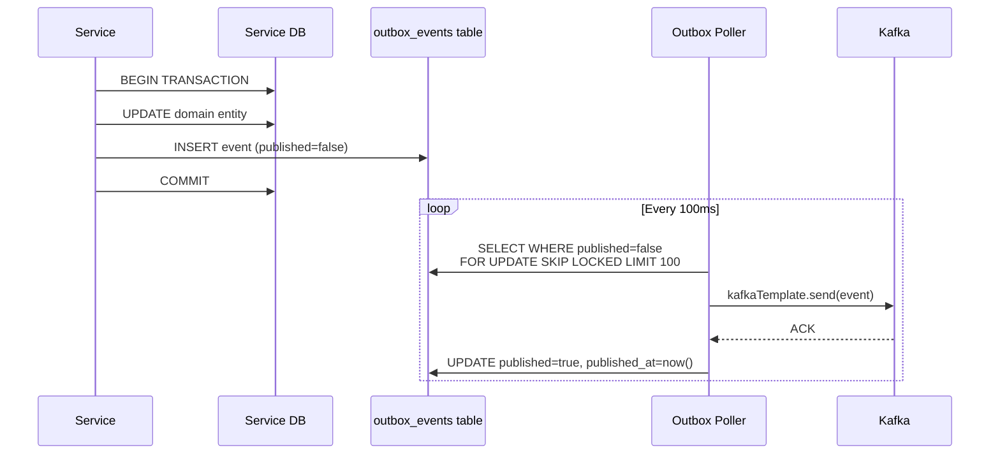

# 07 — Kafka Design

> **Navigation:** [← API Design](06-API-Design.md) | [Redis Design →](08-Redis-Design.md)

---

## Table of Contents

1. [Cluster Configuration](#1-cluster-configuration)
2. [Topic Design](#2-topic-design)
3. [Producer Design](#3-producer-design)
4. [Consumer Design](#4-consumer-design)
5. [Message Schema](#5-message-schema)
6. [Outbox Pattern Integration](#6-outbox-pattern-integration)
7. [Retry and Dead Letter Queue](#7-retry-and-dead-letter-queue)
8. [Ordering Guarantee](#8-ordering-guarantee)
9. [Schema Evolution](#9-schema-evolution)
10. [Event Naming Convention](#10-event-naming-convention)
11. [Monitoring](#11-monitoring)

---

## 1. Cluster Configuration

```yaml
# Kafka cluster: 3 brokers for HA
kafka:
  brokers:
    - kafka-broker-1:9092
    - kafka-broker-2:9092
    - kafka-broker-3:9092
  
  # Replication
  default.replication.factor: 3
  min.insync.replicas: 2          # Must have 2 in-sync replicas for writes
  
  # Retention
  log.retention.hours: 168        # 7 days default
  log.retention.bytes: -1         # No size limit
  
  # Performance
  compression.type: snappy        # CPU/disk trade-off; good for JSON payloads
  
  # Exactly-once semantics (producers)
  enable.idempotence: true
  acks: all                       # Wait for all in-sync replicas
  retries: Integer.MAX_VALUE
  max.in.flight.requests.per.connection: 5
```

---

## 2. Topic Design

### Topic Naming Convention
```
{domain}.{entity}.{event-state}

Examples:
  banking.transaction.initiated
  banking.account.debited
  banking.customer.registered
  banking.fraud.alert.raised
```

For DLQ topics: append `.dlq`
```
banking.transaction.initiated.dlq
```

### Topic Inventory

| Topic | Partitions | Retention | Producer | Consumers |
|-------|-----------|----------|---------|----------|
| `banking.customer.events` | 6 | 30 days | Customer Service | Account Service, Notification, Audit |
| `banking.account.events` | 12 | 30 days | Account Service | Transaction Service, Notification, Audit |
| `banking.transaction.events` | 24 | 90 days | Transaction Service | Notification, Fraud Detection, Audit, Statement |
| `banking.upi.events` | 12 | 30 days | UPI Service | Notification, Audit |
| `banking.fraud.events` | 6 | 90 days | Fraud Detection | Notification, Audit, Account Service |
| `banking.notification.events` | 6 | 7 days | Notification Service | Audit |
| `banking.admin.events` | 3 | 30 days | Admin Service | Notification, Audit |

### Partition Count Rationale
- `banking.transaction.events`: 24 partitions → supports 24 parallel consumers → 24× throughput
- Partitions = max consumers in a consumer group; over-partition for future scaling
- Partition by `accountId` to guarantee ordered processing per account

### Partition Key Strategy
```
banking.customer.events      → partition by customerId
banking.account.events       → partition by accountId
banking.transaction.events   → partition by fromAccountId (debit side drives ordering)
banking.upi.events           → partition by upiId
banking.fraud.events         → partition by accountId
```

---

## 3. Producer Design

### Spring Kafka Producer Configuration

```yaml
spring:
  kafka:
    producer:
      bootstrap-servers: ${KAFKA_BROKERS}
      key-serializer: org.apache.kafka.common.serialization.StringSerializer
      value-serializer: org.springframework.kafka.support.serializer.JsonSerializer
      acks: all
      retries: 3
      retry-backoff-ms: 1000
      enable-idempotence: true
      compression-type: snappy
      properties:
        max.in.flight.requests.per.connection: 5
        delivery.timeout.ms: 120000
        request.timeout.ms: 30000
```

### Event Publisher (per service)

```java
@Component
public class TransactionEventPublisher {
    
    private final KafkaTemplate<String, Object> kafkaTemplate;
    
    public void publishTransactionInitiated(TransactionInitiatedEvent event) {
        Message<TransactionInitiatedEvent> message = MessageBuilder
            .withPayload(event)
            .setHeader(KafkaHeaders.TOPIC, "banking.transaction.events")
            .setHeader(KafkaHeaders.MESSAGE_KEY, event.getFromAccountId())  // partition key
            .setHeader("eventType", "transaction.initiated")
            .setHeader("correlationId", MDC.get("correlationId"))
            .setHeader("eventVersion", "1.0")
            .setHeader("producedAt", Instant.now().toString())
            .build();
        
        kafkaTemplate.send(message).whenComplete((result, ex) -> {
            if (ex != null) {
                log.error("Failed to publish event: {}", event.getTransactionId(), ex);
                // Outbox poller will retry
            }
        });
    }
}
```

---

## 4. Consumer Design

### Spring Kafka Consumer Configuration

```yaml
spring:
  kafka:
    consumer:
      bootstrap-servers: ${KAFKA_BROKERS}
      key-deserializer: org.apache.kafka.common.serialization.StringDeserializer
      value-deserializer: org.springframework.kafka.support.serializer.JsonDeserializer
      auto-offset-reset: earliest
      enable-auto-commit: false          # Manual commit after processing
      max-poll-records: 100
      fetch-min-bytes: 1
      fetch-max-wait-ms: 500
```

### Consumer Group IDs

| Service | Consumer Group ID |
|---------|------------------|
| Notification Service | `notification-service-cg` |
| Fraud Detection | `fraud-detection-cg` |
| Audit Service | `audit-service-cg` |
| Statement Service | `statement-service-cg` |
| Account Service (saga) | `account-service-saga-cg` |
| Transaction Service (saga) | `transaction-service-saga-cg` |

### Example Consumer Implementation

```java
@Component
public class TransactionEventConsumer {
    
    @KafkaListener(
        topics = "banking.transaction.events",
        groupId = "fraud-detection-cg",
        containerFactory = "kafkaListenerContainerFactory"
    )
    @Transactional
    public void consume(
            @Payload TransactionEvent event,
            @Header("eventType") String eventType,
            @Header("correlationId") String correlationId,
            Acknowledgment acknowledgment) {
        
        MDC.put("correlationId", correlationId);
        
        try {
            if ("transaction.initiated".equals(eventType)) {
                fraudDetectionService.evaluate(event);
            }
            acknowledgment.acknowledge();    // Commit offset only on success
        } catch (RetryableException ex) {
            // Do NOT acknowledge → Kafka will re-deliver
            throw ex;
        } catch (NonRetryableException ex) {
            // Send to DLQ, then acknowledge
            dlqPublisher.send("banking.transaction.events.dlq", event);
            acknowledgment.acknowledge();
        } finally {
            MDC.clear();
        }
    }
}
```

### Consumer Concurrency

```java
@Bean
public ConcurrentKafkaListenerContainerFactory<String, Object> kafkaListenerContainerFactory() {
    ConcurrentKafkaListenerContainerFactory<String, Object> factory = ...;
    factory.setConcurrency(4);                    // 4 threads per service instance
    factory.getContainerProperties()
           .setAckMode(AckMode.MANUAL_IMMEDIATE); // Manual commit
    return factory;
}
```

---

## 5. Message Schema

### Base Event Envelope

```json
{
  "eventId": "uuid",
  "eventType": "transaction.initiated",
  "eventVersion": "1.0",
  "producedAt": "2026-08-15T10:30:00.000Z",
  "correlationId": "req-uuid",
  "producerService": "transaction-service",
  "payload": { }
}
```

### Event Payloads

#### transaction.initiated
```json
{
  "transactionId": "uuid",
  "fromAccountId": "uuid",
  "toAccountId": "uuid",
  "amount": 5000.00,
  "currency": "INR",
  "transactionType": "TRANSFER",
  "initiatedBy": "customer-uuid",
  "ipAddress": "192.168.1.1",
  "channel": "MOBILE"
}
```

#### transaction.completed
```json
{
  "transactionId": "uuid",
  "fromAccountId": "uuid",
  "toAccountId": "uuid",
  "amount": 5000.00,
  "currency": "INR",
  "completedAt": "2026-08-15T10:30:05Z",
  "referenceNumber": "REF20260815001"
}
```

#### account.debited
```json
{
  "accountId": "uuid",
  "customerId": "uuid",
  "transactionId": "uuid",
  "amount": 5000.00,
  "previousBalance": 50000.00,
  "newBalance": 45000.00,
  "debitedAt": "2026-08-15T10:30:02Z"
}
```

#### customer.registered
```json
{
  "customerId": "uuid",
  "fullName": "Priya Sharma",
  "email": "priya@example.com",
  "mobile": "9876543210",
  "registeredAt": "2026-08-15T09:00:00Z"
}
```

#### fraud.alert.raised
```json
{
  "alertId": "uuid",
  "accountId": "uuid",
  "transactionId": "uuid",
  "ruleTriggered": "VELOCITY_CHECK",
  "severity": "HIGH",
  "shouldBlock": true,
  "description": "10 transactions in the last hour"
}
```

---

## 6. Outbox Pattern Integration



### Outbox Event Table
```sql
CREATE TABLE outbox_events (
    id              UUID PRIMARY KEY DEFAULT gen_random_uuid(),
    topic           VARCHAR(100) NOT NULL,
    aggregate_type  VARCHAR(50)  NOT NULL,
    aggregate_id    UUID NOT NULL,
    event_type      VARCHAR(100) NOT NULL,
    payload         JSONB NOT NULL,
    published       BOOLEAN NOT NULL DEFAULT FALSE,
    created_at      TIMESTAMP NOT NULL DEFAULT NOW(),
    published_at    TIMESTAMP
);

CREATE INDEX idx_outbox_unpublished ON outbox_events(created_at ASC) WHERE published = FALSE;
```

### Why `FOR UPDATE SKIP LOCKED`
Multiple Outbox Poller instances run in parallel (one per service instance). `SKIP LOCKED` ensures each instance processes a non-overlapping batch without deadlocks.

---

## 7. Retry and Dead Letter Queue

### Retry Strategy

```
1st attempt: Immediate
2nd attempt: +2 seconds (exponential backoff)
3rd attempt: +4 seconds
4th attempt: +8 seconds
After 4 failures → Send to DLQ + acknowledge original
```

### Spring Retry Configuration

```java
@Bean
public DefaultErrorHandler errorHandler(KafkaTemplate<String, Object> template) {
    DeadLetterPublishingRecoverer recoverer = new DeadLetterPublishingRecoverer(template,
        (record, ex) -> new TopicPartition(record.topic() + ".dlq", record.partition())
    );
    
    ExponentialBackOff backOff = new ExponentialBackOff(2000L, 2.0);
    backOff.setMaxAttempts(4);
    
    DefaultErrorHandler handler = new DefaultErrorHandler(recoverer, backOff);
    
    // Non-retryable exceptions go straight to DLQ
    handler.addNotRetryableExceptions(
        NonRetryableBusinessException.class,
        DataIntegrityViolationException.class
    );
    
    return handler;
}
```

### DLQ Processing
- DLQ topics are monitored by a separate `DlqProcessorService`
- Sends alert to admin for manual review
- Provides retry API: `POST /admin/dlq/{topic}/{offset}/retry`

---

## 8. Ordering Guarantee

### Problem
A transfer produces events in sequence:
1. `transaction.initiated`
2. `account.debited`
3. `account.credited`
4. `transaction.completed`

These must be processed in order by the Account Service and Transaction Service.

### Solution
- All events for a given account are published with **accountId as the partition key**
- Kafka guarantees ordering within a partition
- Consumer processes one partition sequentially (no parallel processing within a partition)

```
accountId: ACC001 → always routes to partition 7
All events for ACC001 are ordered within partition 7
```

### Trade-off
- Consumers cannot rebalance mid-saga for a given accountId partition
- Hot accounts (high-frequency trading accounts) may cause partition skew — monitor partition lag

---

## 9. Schema Evolution

### Rules
1. **Add new optional fields** — consumers ignore unknown fields (backwards compatible)
2. **Never remove required fields** — use deprecation cycle: mark deprecated, remove in v2
3. **Never change field types** — add a new field with the new type
4. **Use `eventVersion` field** — consumers branch on version for handling

### Versioning Example
```json
// v1.0
{ "customerId": "uuid", "email": "...", "mobile": "..." }

// v1.1 (added optional field — backwards compatible)
{ "customerId": "uuid", "email": "...", "mobile": "...", "referralCode": null }

// v2.0 (breaking change → new topic or version header)
{ "customerId": "uuid", "emailAddress": "...", "mobileNumber": "..." }
```

### Consumer Handling
```java
if ("1.0".equals(event.getEventVersion())) {
    processV1(event);
} else if ("2.0".equals(event.getEventVersion())) {
    processV2(event);
}
```

---

## 10. Event Naming Convention

```
Format: {entity}.{past-tense-action}

customer.registered
customer.kyc.submitted
customer.kyc.approved
customer.kyc.rejected
customer.frozen
customer.unfrozen
customer.closed

account.created
account.debited
account.credited
account.frozen
account.unfrozen
account.closed

transaction.initiated
transaction.fraud.checking
transaction.completed
transaction.failed
transaction.reversed

upi.id.created
upi.transfer.initiated
upi.transfer.completed
upi.transfer.failed

fraud.check.passed
fraud.alert.raised
fraud.account.frozen

notification.sent
notification.failed
```

---

## 11. Monitoring

### Key Metrics to Monitor

| Metric | Alert Threshold | Action |
|--------|----------------|--------|
| Consumer group lag | > 10,000 messages | Scale up consumers |
| Producer error rate | > 1% | Check broker health |
| DLQ message rate | > 10/min | Investigate consumer errors |
| End-to-end latency (produce → consume) | > 5 seconds | Check consumer throughput |
| Broker under-replicated partitions | > 0 | Check broker health |
| Kafka broker disk usage | > 75% | Reduce retention or add storage |

### Grafana Dashboard Panels
- Consumer lag per consumer group
- Message rate per topic (produce/consume)
- DLQ message count
- End-to-end event processing latency
- Broker health (leader election rate, under-replicated)

---

> **Next:** [Redis Design →](08-Redis-Design.md)
