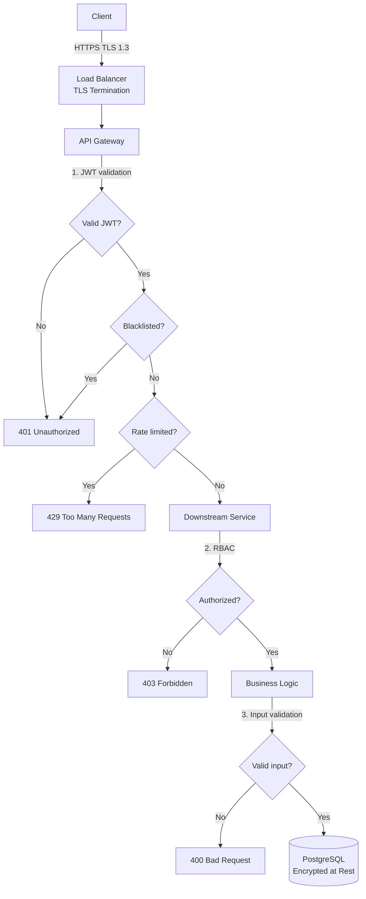
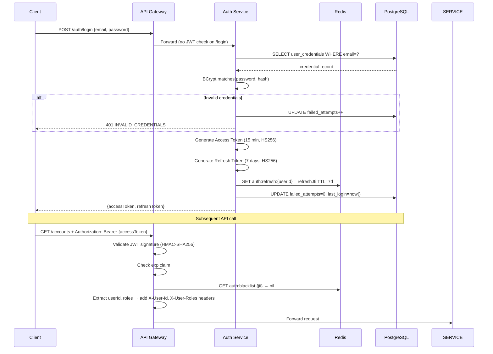
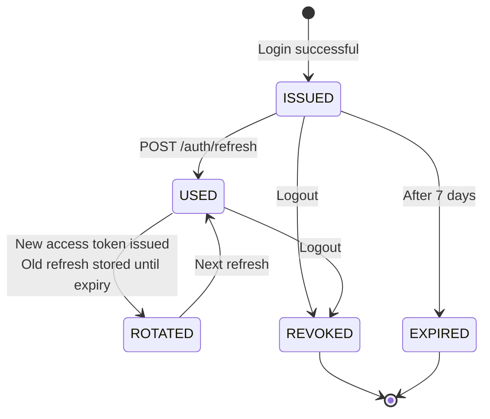
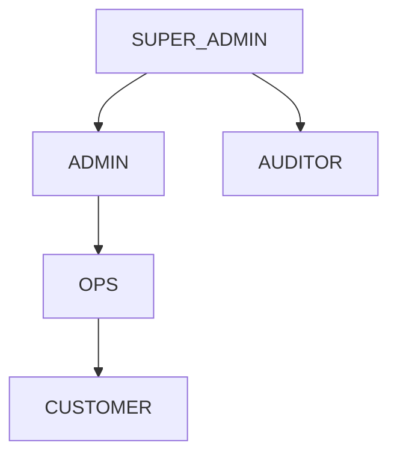

# 09 — Security Design

> **Navigation:** [← Redis Design](08-Redis-Design.md) | [Deployment →](10-Deployment.md)

---

## Table of Contents

1. [Security Architecture Overview](#1-security-architecture-overview)
2. [Authentication Flow](#2-authentication-flow)
3. [JWT Token Design](#3-jwt-token-design)
4. [Refresh Token Lifecycle](#4-refresh-token-lifecycle)
5. [Password Security](#5-password-security)
6. [Role-Based Access Control (RBAC)](#6-role-based-access-control-rbac)
7. [API Gateway Security](#7-api-gateway-security)
8. [CORS Configuration](#8-cors-configuration)
9. [CSRF Protection](#9-csrf-protection)
10. [Rate Limiting](#10-rate-limiting)
11. [Input Validation and Injection Prevention](#11-input-validation-and-injection-prevention)
12. [Sensitive Data Encryption](#12-sensitive-data-encryption)
13. [Secrets Management](#13-secrets-management)
14. [Security Headers](#14-security-headers)
15. [Audit Logging](#15-audit-logging)
16. [Threat Model](#16-threat-model)

---

## 1. Security Architecture Overview



**Security Layers:**
1. **Transport Layer** — TLS 1.3, HSTS
2. **Edge Layer** — JWT validation, rate limiting, blacklist check (API Gateway)
3. **Service Layer** — RBAC authorization, input validation (each service)
4. **Data Layer** — Encryption at rest, PII masking in logs

---

## 2. Authentication Flow



### Account Lockout Policy
```
3 failed attempts  → Warning email sent
5 failed attempts  → Account locked for 15 minutes
10 failed attempts → Account locked until admin review
```

---

## 3. JWT Token Design

### Access Token Claims
```json
{
  "sub": "550e8400-e29b-41d4-a716-446655440000",
  "jti": "a1b2c3d4-e5f6-7890-abcd-ef1234567890",
  "iat": 1723712400,
  "exp": 1723713300,
  "userId": "550e8400-e29b-41d4-a716-446655440000",
  "email": "priya@example.com",
  "roles": ["ROLE_CUSTOMER"],
  "accountIds": ["bbbbbbbb-bbbb-bbbb-bbbb-bbbbbbbbbbbb"],
  "tokenType": "ACCESS"
}
```

### Refresh Token Claims
```json
{
  "sub": "550e8400-e29b-41d4-a716-446655440000",
  "jti": "x9y8z7w6-v5u4-t3s2-r1q0-p9o8n7m6l5k4",
  "iat": 1723712400,
  "exp": 1724317200,
  "userId": "550e8400-e29b-41d4-a716-446655440000",
  "tokenType": "REFRESH"
}
```

### Token Configuration
```yaml
jwt:
  secret: ${JWT_SECRET}          # 256-bit base64-encoded secret from environment
  access-token-expiry: 900       # 15 minutes in seconds
  refresh-token-expiry: 604800   # 7 days in seconds
  algorithm: HS256
```

### JWT Validation (API Gateway Filter)
```java
@Component
public class JwtAuthenticationFilter implements GatewayFilter {
    
    public Mono<Void> filter(ServerWebExchange exchange, GatewayFilterChain chain) {
        String authHeader = exchange.getRequest().getHeaders().getFirst("Authorization");
        
        if (authHeader == null || !authHeader.startsWith("Bearer ")) {
            return unauthorized(exchange);
        }
        
        String token = authHeader.substring(7);
        
        try {
            Claims claims = jwtUtil.validateAndExtract(token);
            
            // Check blacklist
            if (tokenBlacklistService.isBlacklisted(claims.getId())) {
                return unauthorized(exchange);
            }
            
            // Check token type (must be ACCESS, not REFRESH)
            if (!"ACCESS".equals(claims.get("tokenType"))) {
                return unauthorized(exchange);
            }
            
            // Forward identity to downstream
            ServerHttpRequest mutated = exchange.getRequest().mutate()
                .header("X-User-Id", claims.get("userId", String.class))
                .header("X-User-Roles", String.join(",", (List<String>) claims.get("roles")))
                .header("X-Account-Ids", String.join(",", (List<String>) claims.get("accountIds")))
                .build();
            
            return chain.filter(exchange.mutate().request(mutated).build());
            
        } catch (ExpiredJwtException e) {
            return unauthorized(exchange, "TOKEN_EXPIRED");
        } catch (JwtException e) {
            return unauthorized(exchange, "TOKEN_INVALID");
        }
    }
}
```

---

## 4. Refresh Token Lifecycle



### Refresh Token Rotation (Security Enhancement)
On each refresh request, issue a **new refresh token** and invalidate the old one. This limits the window of refresh token theft exploitation.

```java
public TokenResponse refresh(String refreshToken) {
    Claims claims = jwtUtil.validateAndExtract(refreshToken);
    String userId = claims.get("userId", String.class);
    String jti = claims.getId();
    
    // Verify stored JTI matches (prevents replay of old refresh tokens)
    String storedJti = redisTemplate.opsForValue().get("auth:refresh:" + userId);
    if (!jti.equals(storedJti)) {
        // Possible token theft — revoke all sessions
        redisTemplate.delete("auth:refresh:" + userId);
        throw new TokenCompromisedException(userId);
    }
    
    // Issue new tokens
    String newAccessToken = tokenService.generateAccessToken(userId, claims.get("roles"));
    String newRefreshToken = tokenService.generateRefreshToken(userId);
    String newRefreshJti = jwtUtil.extractJti(newRefreshToken);
    
    // Rotate: store new refresh JTI
    redisTemplate.opsForValue().set("auth:refresh:" + userId, newRefreshJti, Duration.ofDays(7));
    
    return new TokenResponse(newAccessToken, newRefreshToken);
}
```

---

## 5. Password Security

### Hashing Algorithm: BCrypt
```java
@Bean
public PasswordEncoder passwordEncoder() {
    return new BCryptPasswordEncoder(12);  // Cost factor 12 (~250ms per hash on modern hardware)
}
```

**Why BCrypt with cost 12:**
- Adaptive — cost factor increases as hardware gets faster
- Built-in salt — prevents rainbow table attacks
- 250ms hash time is imperceptible to users but expensive for brute-force

### Password Policy (Enforced via Validation)
```
Minimum length: 8 characters
Must contain:
  - At least 1 uppercase letter
  - At least 1 lowercase letter
  - At least 1 digit
  - At least 1 special character (@#$%^&+=!)
Maximum length: 72 characters (BCrypt limitation)
Cannot be same as last 5 passwords
Cannot contain username or email
```

### Password History
```sql
CREATE TABLE password_history (
    id              UUID PRIMARY KEY DEFAULT gen_random_uuid(),
    customer_id     UUID NOT NULL REFERENCES customers(id),
    password_hash   VARCHAR(255) NOT NULL,
    created_at      TIMESTAMP NOT NULL DEFAULT NOW()
);
```

---

## 6. Role-Based Access Control (RBAC)

### Roles and Hierarchy



### Role Permissions Matrix

| Permission | CUSTOMER | OPS | ADMIN | AUDITOR | SUPER_ADMIN |
|-----------|----------|-----|-------|---------|-------------|
| View own profile | ✓ | ✓ | ✓ | ✓ | ✓ |
| Update own profile | ✓ | — | ✓ | — | ✓ |
| View own accounts | ✓ | ✓ | ✓ | ✓ | ✓ |
| View own transactions | ✓ | ✓ | ✓ | ✓ | ✓ |
| Create transaction | ✓ | — | ✓ | — | ✓ |
| Reverse transaction | — | — | ✓ | — | ✓ |
| View all customers | — | ✓ | ✓ | ✓ | ✓ |
| Freeze account | — | — | ✓ | — | ✓ |
| Approve KYC | — | — | ✓ | — | ✓ |
| View fraud alerts | — | ✓ | ✓ | ✓ | ✓ |
| Resolve fraud alerts | — | — | ✓ | — | ✓ |
| View audit logs | — | — | — | ✓ | ✓ |
| Manage admin users | — | — | — | — | ✓ |

### Spring Security Configuration (per service)

```java
@Configuration
@EnableMethodSecurity
public class SecurityConfig {
    
    @Bean
    public SecurityFilterChain securityFilterChain(HttpSecurity http) throws Exception {
        return http
            .csrf(AbstractHttpConfigurer::disable)          // Stateless API; JWT is CSRF protection
            .sessionManagement(session -> 
                session.sessionCreationPolicy(SessionCreationPolicy.STATELESS))
            .authorizeHttpRequests(auth -> auth
                .requestMatchers("/actuator/health").permitAll()
                .requestMatchers("/actuator/**").hasRole("ADMIN")
                .anyRequest().authenticated()
            )
            .addFilterBefore(jwtExtractorFilter, UsernamePasswordAuthenticationFilter.class)
            .build();
    }
}

// Method-level authorization example
@PreAuthorize("hasRole('ADMIN') or (hasRole('CUSTOMER') and #customerId == authentication.principal.userId)")
public CustomerResponse getCustomer(UUID customerId) { ... }
```

---

## 7. API Gateway Security

### Security Filter Chain (Gateway)

```
Request →
  1. HTTPS enforcement (redirect HTTP to HTTPS)
  2. Security headers addition
  3. Rate limit check (Redis)
  4. JWT validation + blacklist check
  5. Role claim extraction → X-User-Id, X-User-Roles headers
  6. Request logging (masked PII)
  → Downstream Service
```

### IP Allowlist for Admin APIs
Admin endpoints (`/api/v1/admin/**`) additionally require requests to originate from corporate network CIDRs (configurable via Config Service).

---

## 8. CORS Configuration

```java
@Bean
public CorsWebFilter corsFilter() {
    CorsConfiguration config = new CorsConfiguration();
    config.setAllowedOrigins(List.of(
        "https://banking.example.com",          // Production web portal
        "https://admin.banking.example.com",    // Admin portal
        "http://localhost:3000"                 // Dev only
    ));
    config.setAllowedMethods(List.of("GET", "POST", "PUT", "DELETE", "OPTIONS"));
    config.setAllowedHeaders(List.of(
        "Authorization", "Content-Type", "Idempotency-Key", "X-Correlation-Id"
    ));
    config.setAllowCredentials(false);           // No cookies — JWT in header
    config.setMaxAge(3600L);
    
    UrlBasedCorsConfigurationSource source = new UrlBasedCorsConfigurationSource();
    source.registerCorsConfiguration("/api/**", config);
    return new CorsWebFilter(source);
}
```

---

## 9. CSRF Protection

**CSRF protection is not needed for this API** because:
- All APIs are stateless (no session cookies)
- JWT in `Authorization` header cannot be sent cross-origin by browser (unlike cookies)
- CORS policy restricts which origins can make requests

This is the standard approach for REST APIs using JWT Bearer tokens (RFC 6750).

---

## 10. Rate Limiting

See [Redis Design — Rate Limiting](08-Redis-Design.md#7-rate-limiting) for implementation details.

### Rate Limit Tiers

| Endpoint | Limit | Window | Key |
|----------|-------|--------|-----|
| `POST /auth/login` | 10 | 1 minute | per IP |
| `POST /auth/otp/send` | 5 | 1 hour | per mobile |
| `POST /customers/register` | 3 | 1 hour | per IP |
| All authenticated APIs | 100 | 1 minute | per userId |
| Transfer APIs | 20 | 1 minute | per userId |
| Statement download | 5 | 1 hour | per userId |
| Admin APIs | 500 | 1 minute | per adminId |

---

## 11. Input Validation and Injection Prevention

### SQL Injection Prevention
- **Spring Data JPA** uses parameterized queries by default — no string concatenation in queries
- **Hibernate** does not allow raw SQL injection through entity methods
- **Custom JPQL queries** use `:param` named parameters, never string interpolation

```java
// SAFE - parameterized
@Query("SELECT c FROM Customer c WHERE c.email = :email")
Optional<Customer> findByEmail(@Param("email") String email);

// NEVER do this:
// @Query("SELECT c FROM Customer c WHERE c.email = '" + email + "'")
```

### XSS Prevention
- All API responses are `application/json` — browsers don't execute JSON as scripts
- Input validation rejects `<script>`, `javascript:` patterns in text fields
- Content-Security-Policy header prevents inline script execution in admin portal

### Input Validation (javax.validation)

```java
public class CustomerRegistrationRequest {
    
    @NotBlank(message = "Full name is required")
    @Size(min = 2, max = 100, message = "Full name must be 2-100 characters")
    @Pattern(regexp = "^[a-zA-Z .']+$", message = "Name contains invalid characters")
    private String fullName;
    
    @NotBlank
    @Email(message = "Must be a valid email address")
    @Size(max = 150)
    private String email;
    
    @NotBlank
    @Pattern(regexp = "^[6-9]\\d{9}$", message = "Must be a valid 10-digit Indian mobile number")
    private String mobile;
    
    @NotBlank
    @Size(min = 8, max = 72)
    @Pattern(regexp = "^(?=.*[A-Z])(?=.*[a-z])(?=.*\\d)(?=.*[@#$%^&+=!]).{8,}$",
             message = "Password must contain uppercase, lowercase, digit, and special character")
    private String password;
    
    @NotNull
    @Past(message = "Date of birth must be in the past")
    private LocalDate dateOfBirth;
}
```

### Request Size Limits
```yaml
spring:
  servlet:
    multipart:
      max-file-size: 10MB       # KYC document upload limit
      max-request-size: 12MB
server:
  tomcat:
    max-http-form-post-size: 2MB
```

---

## 12. Sensitive Data Encryption

### PII Masking in Logs
```java
@Aspect
@Component
public class PiiMaskingAspect {
    
    // Mask mobile numbers: 9876543210 → 98765XXXXX
    // Mask Aadhaar: 123456789012 → XXXXXXXX9012
    // Mask account numbers: 2026081500001234 → XXXXXX1234
    // Never log: passwords, PINs, OTPs, JWT tokens
}
```

### Database Encryption
- **Aadhaar number** — AES-256 encrypted before storage; only last 4 digits visible
- **UPI PIN** — BCrypt hashed (one-way); never stored in plaintext
- **Password** — BCrypt hashed (cost 12)
- **KYC documents** — Stored in S3/MinIO with server-side encryption (AES-256)
- **Database at rest** — PostgreSQL tablespace encryption (pgcrypto or volume-level encryption)

### AES Encryption Utility
```java
@Component
public class AesEncryptor {
    
    @Value("${encryption.key}")     // From Config Service / Vault
    private String encryptionKey;
    
    public String encrypt(String plaintext) {
        // AES-256-GCM with random IV
        byte[] iv = new byte[12];
        new SecureRandom().nextBytes(iv);
        // ... encryption logic
    }
    
    public String decrypt(String ciphertext) { ... }
}
```

---

## 13. Secrets Management

### Development
Secrets in `application.properties` or environment variables.

### Production
- **HashiCorp Vault** or **AWS Secrets Manager** for:
  - JWT signing secret
  - Database credentials
  - Kafka SASL credentials
  - Redis password
  - Twilio API keys
  - FCM server key
  - AES encryption key

### Spring Cloud Vault Integration
```yaml
spring:
  cloud:
    vault:
      host: vault.internal
      port: 8200
      authentication: KUBERNETES   # Pod's service account token
      kv:
        enabled: true
        backend: secret
        default-context: banking/transaction-service
```

### Secret Rotation
- JWT secrets: rotated every 90 days (new secret deployed; old accepted for 15 minutes during transition)
- Database passwords: rotated every 30 days via Vault dynamic secrets

---

## 14. Security Headers

Applied by API Gateway to all responses:

```
Strict-Transport-Security: max-age=31536000; includeSubDomains; preload
X-Content-Type-Options: nosniff
X-Frame-Options: DENY
Content-Security-Policy: default-src 'none'; frame-ancestors 'none'
Referrer-Policy: strict-origin-when-cross-origin
Permissions-Policy: camera=(), microphone=(), geolocation=()
Cache-Control: no-store, no-cache, must-revalidate, private
X-XSS-Protection: 0    (deprecated; CSP is the modern replacement)
```

---

## 15. Audit Logging

Every security event is written to the `audit_logs` table and published to Kafka `banking.admin.events` topic.

### Audited Events

| Event | Log Level | Retention |
|-------|-----------|-----------|
| Login success | INFO | 7 years |
| Login failure | WARN | 7 years |
| Account locked | WARN | 7 years |
| Password changed | INFO | 7 years |
| Token revoked | INFO | 7 years |
| Account frozen | WARN | 7 years |
| KYC approved/rejected | INFO | 7 years |
| Transaction reversed | INFO | 7 years |
| Admin action (any) | INFO | 7 years |
| Fraud alert raised | WARN | 7 years |

### Audit Log Immutability
- Audit logs table: no `UPDATE` or `DELETE` granted to application DB user
- Application DB user has `INSERT`, `SELECT` only on `audit_logs`
- Regulatory requirement: 7-year retention per RBI digital payments guidelines

---

## 16. Threat Model

| Threat | STRIDE | Mitigation |
|--------|--------|-----------|
| Token theft | Spoofing | Short 15-min access token TTL; refresh token rotation |
| Brute force login | Spoofing | Account lockout after 5 failures; CAPTCHA (v2) |
| Replay attack | Repudiation | JWT JTI (unique per token); idempotency keys |
| Man-in-the-middle | Tampering | TLS 1.3; HSTS preloading |
| SQL injection | Tampering | Parameterized queries; ORM enforces this |
| DDoS | DoS | Rate limiting per user/IP; CDN-level protection |
| Unauthorized access | Elevation | RBAC enforced at service level; audit logs |
| Insider threat | Repudiation | All admin actions audited; read-only audit access |
| Data breach | Information Disclosure | PII encrypted at rest; masking in logs |
| Session fixation | Spoofing | New JWT issued on login; no session reuse |

---

> **Next:** [Deployment →](10-Deployment.md)
