# 11 — UML Diagrams

> **Navigation:** [← Deployment](10-Deployment.md) | [Folder Structure →](12-Folder-Structure.md)

All diagrams use Mermaid syntax and render on GitHub, GitLab, and most modern documentation platforms.

---

## Table of Contents

1. [Class Diagram — Core Domain](#1-class-diagram--core-domain)
2. [Class Diagram — Transaction Saga](#2-class-diagram--transaction-saga)
3. [Sequence Diagram — Transfer Flow](#3-sequence-diagram--transfer-flow)
4. [Sequence Diagram — UPI Transfer](#4-sequence-diagram--upi-transfer)
5. [Sequence Diagram — Customer Registration](#5-sequence-diagram--customer-registration)
6. [Activity Diagram — Fraud Detection](#6-activity-diagram--fraud-detection)
7. [Activity Diagram — Statement Generation](#7-activity-diagram--statement-generation)
8. [State Diagram — Account Lifecycle](#8-state-diagram--account-lifecycle)
9. [State Diagram — Transaction Status](#9-state-diagram--transaction-status)
10. [State Diagram — Customer Lifecycle](#10-state-diagram--customer-lifecycle)
11. [Component Diagram](#11-component-diagram)
12. [Deployment Diagram](#12-deployment-diagram)

---

## 1. Class Diagram — Core Domain

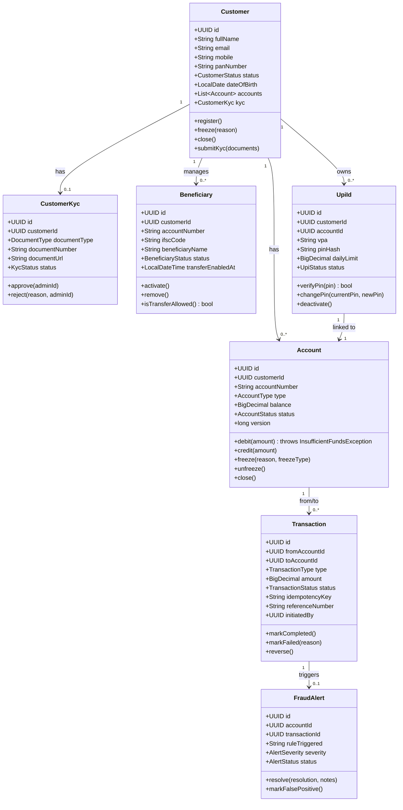

---

## 2. Class Diagram — Transaction Saga

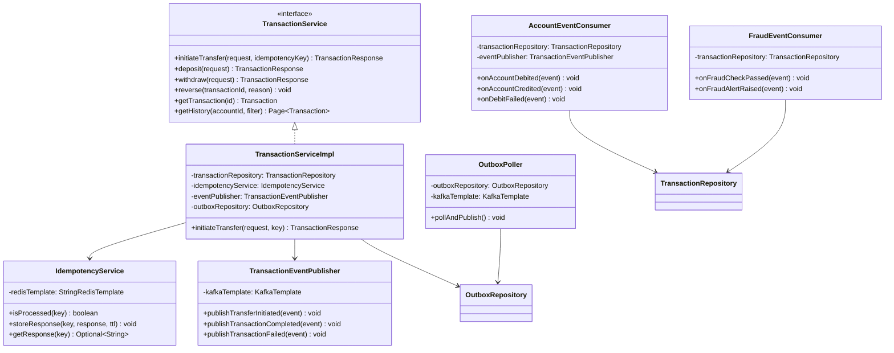

---

## 3. Sequence Diagram — Transfer Flow

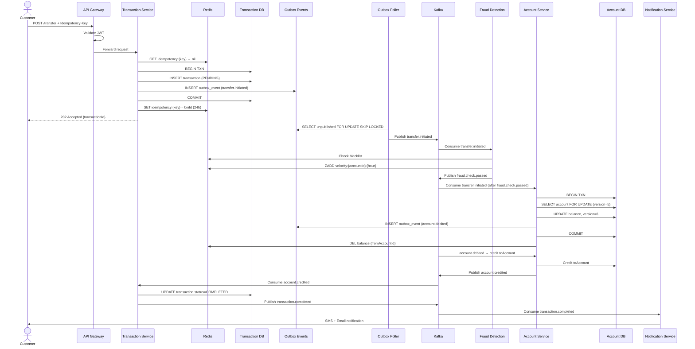

---

## 4. Sequence Diagram — UPI Transfer

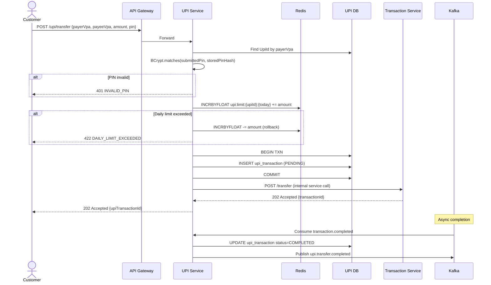

---

## 5. Sequence Diagram — Customer Registration

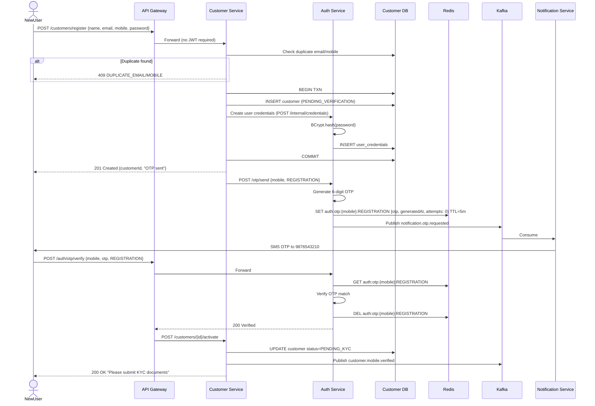

---

## 6. Activity Diagram — Fraud Detection

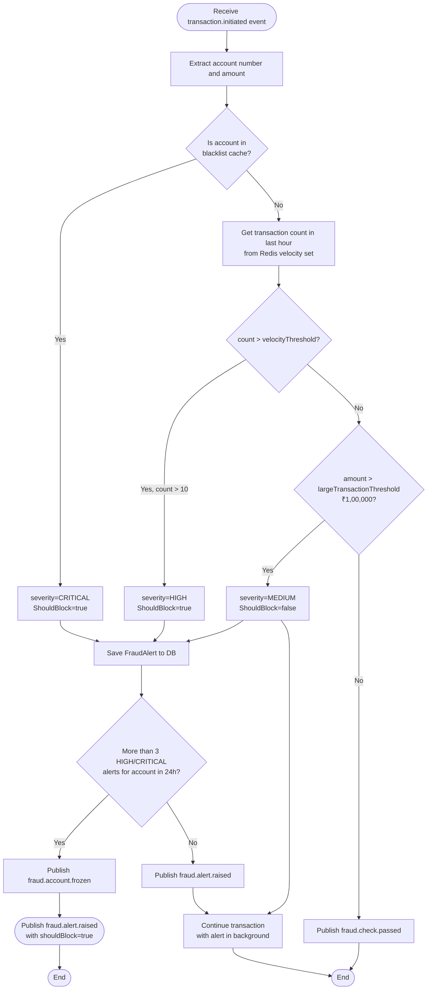

---

## 7. Activity Diagram — Statement Generation

```mermaid
flowchart TD
    START([1st of month — Scheduler triggers]) --> A

    A[Query all active accounts from DB] --> B

    B[For each account\ncreate Statement record status=PENDING] --> C

    C[Publish statement.generation.requested\nto Kafka for each account] --> D

    D[Statement Service Consumer\nreceives event] --> E

    E[Query transactions for account\nfor the previous month\nfrom read replica] --> F

    F{Transactions found?}
    F -->|No| EMPTY[Generate empty statement PDF]
    F -->|Yes| CALC

    CALC[Calculate opening/closing balance\ntotal credits/debits\nrunning balance per transaction] --> G

    G[Generate PDF using iText/PDFBox] --> H

    H[Upload PDF to MinIO/S3\nkey: statements/{year}/{month}/{accountId}.pdf] --> I

    I[UPDATE statement\nstatus=GENERATED\ns3_key=...\ngenerated_at=now] --> J

    EMPTY --> I

    J[Publish statement.generated event] --> K

    K[Notification Service consumes\nSend email with download link] --> END([Done])

    G -->|Exception| FAIL[UPDATE status=FAILED\nPublish statement.generation.failed]
    FAIL --> RETRY{Retry count < 3?}
    RETRY -->|Yes| D
    RETRY -->|No| ALERT[Send alert to admin] --> END
```

---

## 8. State Diagram — Account Lifecycle

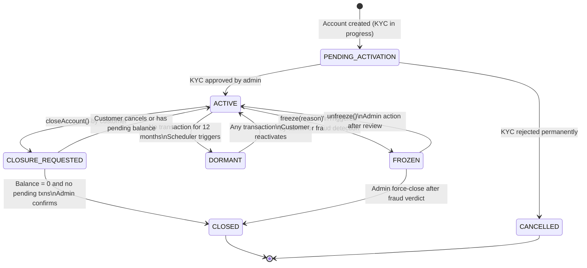

---

## 9. State Diagram — Transaction Status

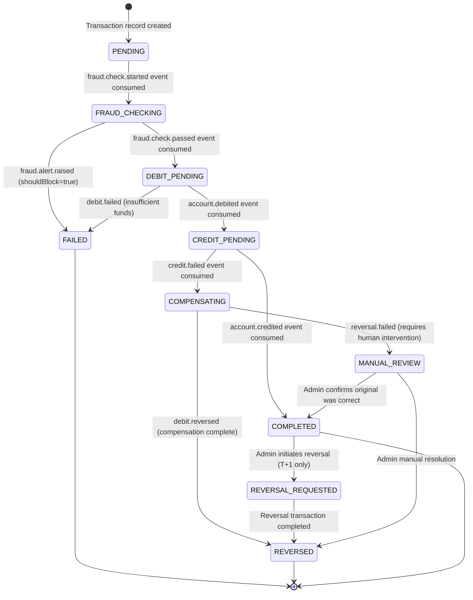

---

## 10. State Diagram — Customer Lifecycle

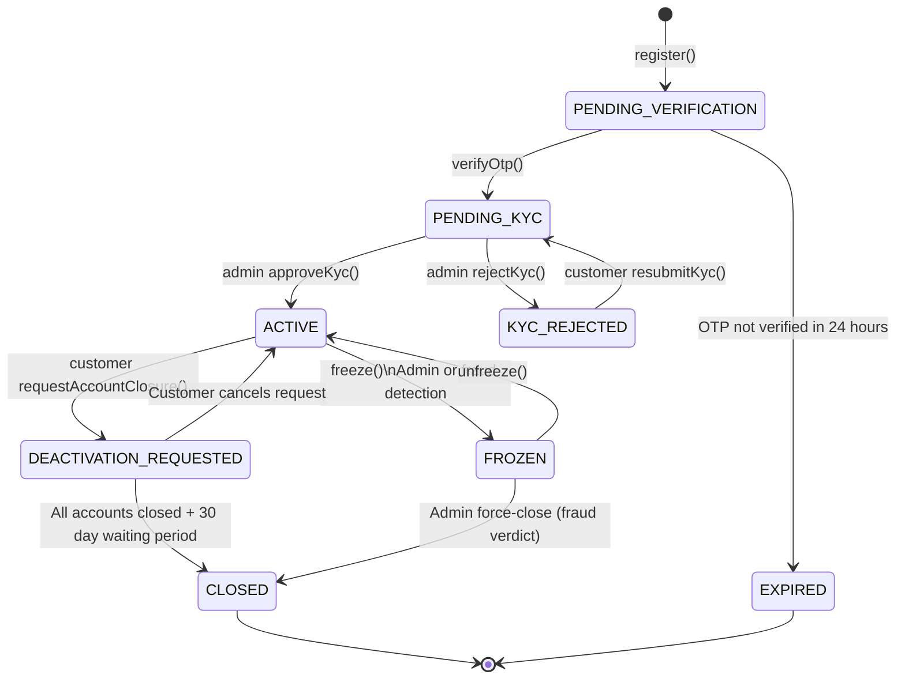

---

## 11. Component Diagram

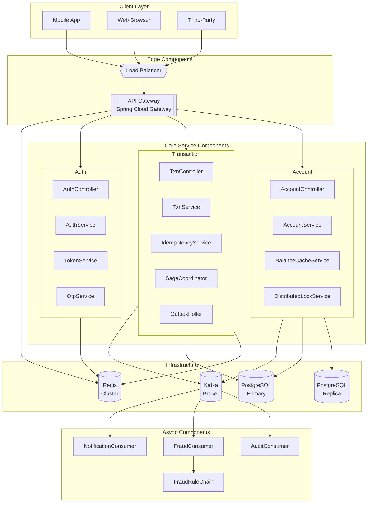

---

## 12. Deployment Diagram

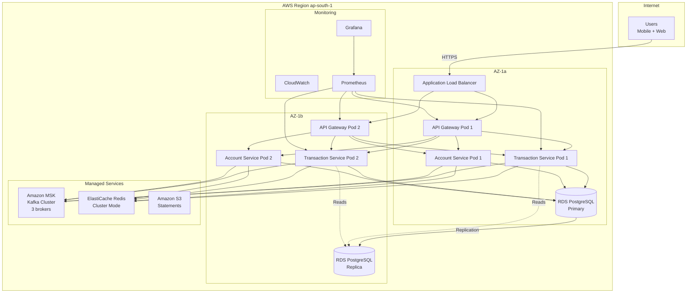

---

> **Next:** [Folder Structure →](12-Folder-Structure.md)
