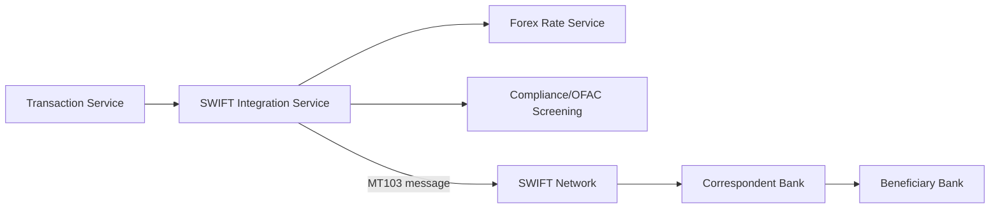
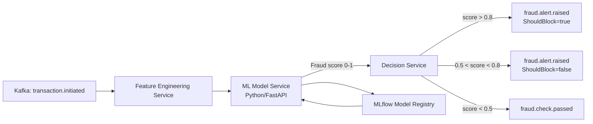
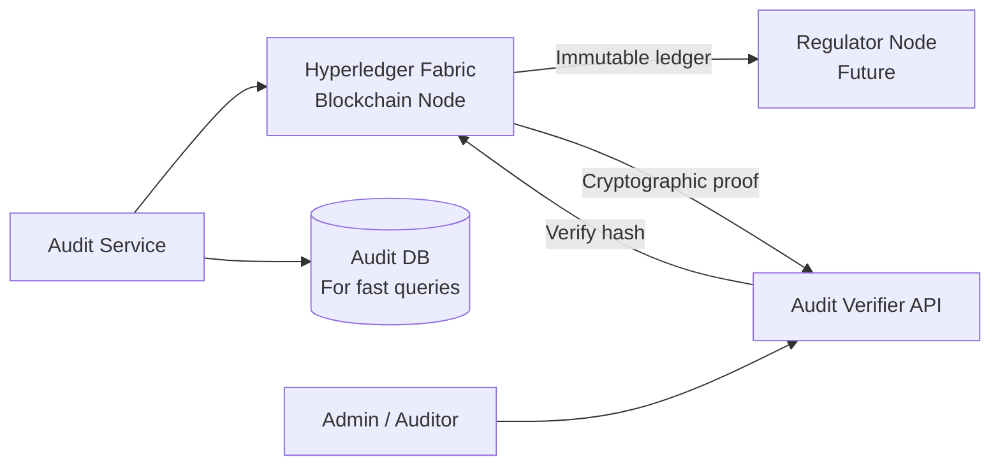
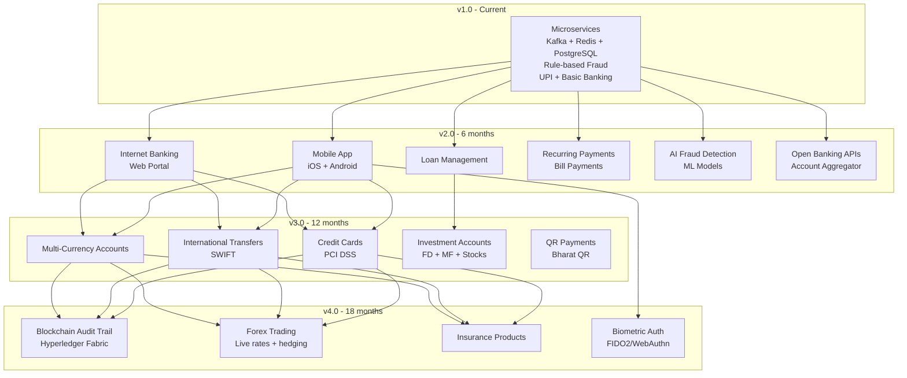

# 14 — Future Enhancements

> **Navigation:** [← Design Patterns](13-Design-Patterns.md) | [Back to README](README.md)

---

## Table of Contents

1. [Internet Banking Portal](#1-internet-banking-portal)
2. [Mobile Banking App](#2-mobile-banking-app)
3. [Loan Management System](#3-loan-management-system)
4. [Credit Cards](#4-credit-cards)
5. [International Transfers (SWIFT)](#5-international-transfers-swift)
6. [Multi-Currency Accounts](#6-multi-currency-accounts)
7. [Recurring Payments](#7-recurring-payments)
8. [Bill Payments (BBPS)](#8-bill-payments-bbps)
9. [QR Code Payments](#9-qr-code-payments)
10. [Investment Accounts](#10-investment-accounts)
11. [AI-Powered Fraud Detection](#11-ai-powered-fraud-detection)
12. [Machine Learning Integration](#12-machine-learning-integration)
13. [Blockchain-Based Audit Trail](#13-blockchain-based-audit-trail)
14. [Open Banking APIs](#14-open-banking-apis)
15. [Biometric Authentication](#15-biometric-authentication)
16. [Architecture Evolution Path](#16-architecture-evolution-path)

---

## 1. Internet Banking Portal

### Description
A full-featured web portal for retail customers to manage accounts, view statements, initiate transfers, and manage beneficiaries without a mobile app.

### Technical Approach
- **Frontend**: React.js with TypeScript; served via a separate BFF (Backend for Frontend) service
- **BFF Service**: Spring Boot service that aggregates data from multiple microservices (Customer, Account, Transaction) and returns tailored responses for the web UI
- **Session Management**: Extend Auth Service to support web sessions with PKCE-based OAuth 2.0 flow
- **Accessibility**: WCAG 2.1 AA compliance

### New Services Required
- `web-bff-service` — aggregates Customer, Account, Transaction APIs for web
- `document-service` — manages statement downloads, KYC document uploads

### Integration Points
- Auth Service: OAuth 2.0 Authorization Code flow with PKCE
- All core services via internal API calls from BFF

---

## 2. Mobile Banking App

### Description
iOS and Android native apps providing the full banking experience with biometrics, push notifications, and offline balance views.

### Technical Approach
- **iOS**: Swift + SwiftUI
- **Android**: Kotlin + Jetpack Compose
- **API**: Mobile BFF Service (different from web BFF — mobile requires compressed, mobile-optimized responses)
- **Push**: Firebase Cloud Messaging (already integrated in Notification Service)
- **Offline**: Balance and recent transactions cached locally (SQLite/Room on Android, CoreData on iOS)

### Auth Enhancements
- Device registration API in Auth Service (store device fingerprint per user)
- Certificate Pinning for all HTTPS calls
- App-level lock: PIN/biometric required to re-enter foreground

### New APIs
```
POST /api/v1/mobile/auth/register-device
POST /api/v1/mobile/auth/biometric-login
GET  /api/v1/mobile/dashboard  (aggregated BFF response)
```

---

## 3. Loan Management System

### Description
Personal, home, and auto loan origination, disbursement, EMI scheduling, and collection.

### New Services
- **Loan Origination Service** — application, credit scoring, underwriting
- **Loan Disbursement Service** — triggers Account Service credit on approval
- **EMI Scheduler Service** — calculates and tracks EMI schedules
- **Collection Service** — handles overdue EMI tracking and recovery workflows

### New Database Tables

```sql
CREATE TABLE loan_applications (
    id              UUID PRIMARY KEY,
    customer_id     UUID NOT NULL REFERENCES customers(id),
    loan_type       VARCHAR(20),    -- PERSONAL, HOME, AUTO
    requested_amount DECIMAL(18,2),
    tenure_months   INT,
    purpose         VARCHAR(255),
    status          VARCHAR(30),    -- APPLIED, UNDER_REVIEW, APPROVED, REJECTED, DISBURSED
    credit_score    INT,
    interest_rate   DECIMAL(5,2),
    created_at      TIMESTAMP
);

CREATE TABLE loan_emis (
    id              UUID PRIMARY KEY,
    loan_id         UUID NOT NULL,
    emi_number      INT,
    due_date        DATE,
    principal_amount DECIMAL(18,2),
    interest_amount  DECIMAL(18,2),
    total_emi_amount DECIMAL(18,2),
    status          VARCHAR(20),    -- PENDING, PAID, OVERDUE, WAIVED
    paid_on         TIMESTAMP
);
```

### Architecture Impact
- Loan Disbursement triggers an Account credit via Transaction Service
- EMI Scheduler uses a new Kafka topic: `banking.loan.events`
- Credit scoring integrates with external bureau APIs (CIBIL, Experian) via Adapter pattern

---

## 4. Credit Cards

### Description
Virtual and physical credit card issuance, statement cycle management, reward points, and payment processing.

### New Services
- **Card Service** — card issuance (virtual/physical), PAN management, CVV
- **Card Transaction Service** — real-time authorization, hold/settle lifecycle
- **Rewards Service** — points accumulation, redemption, expiry
- **Card Statement Service** — monthly billing cycle, minimum due calculation

### Key Design Considerations
- **Card PAN** — never stored in plaintext; tokenized (PCI DSS Level 1 compliance)
- **Authorization Hold** — card transaction has two steps: AUTHORIZE (hold) → SETTLE (finalize) or VOID
- **International**: Card transactions are multi-currency from day 1

### New Database Tables

```sql
CREATE TABLE credit_cards (
    id              UUID PRIMARY KEY,
    customer_id     UUID NOT NULL,
    card_number_token VARCHAR(50),   -- Tokenized PAN (actual PAN in HSM)
    card_type       VARCHAR(20),     -- VISA, MASTERCARD
    credit_limit    DECIMAL(18,2),
    available_limit DECIMAL(18,2),
    billing_date    INT,             -- Day of month
    due_date_offset INT DEFAULT 20,  -- Days after billing date
    status          VARCHAR(20)
);
```

---

## 5. International Transfers (SWIFT)

### Description
Cross-border wire transfers using the SWIFT gpi (global payments innovation) protocol.

### New Services
- **SWIFT Integration Service** — adapter to SWIFT network (MT103, ISO 20022 messages)
- **Forex Rate Service** — real-time exchange rate feeds from providers (Bloomberg, XE)
- **Compliance Service** — OFAC/sanctions list screening for international transfers

### Key Design Considerations
- **Correspondent Banking**: International transfers route through correspondent banks; Saga spans multiple external hops
- **T+2/T+3 Settlement**: Unlike UPI (T+0), SWIFT transfers settle over 2-3 business days; transaction status is `IN_TRANSIT` for extended periods
- **AML Screening**: Every international transfer screened against OFAC, UN, EU sanctions lists before SWIFT message is sent

### Architecture Impact


---

## 6. Multi-Currency Accounts

### Description
Allow customers to hold balances in multiple currencies (USD, EUR, GBP) within the same account structure.

### Changes Required
- `accounts` table: add `base_currency` column
- New `account_currency_balances` table: `accountId, currency, balance, version`
- Forex Service provides real-time rates for balance conversion display
- Transaction Service: handle cross-currency transfers with FX rate applied and stored on transaction

### Account Balance Display
```json
{
  "accountId": "uuid",
  "baseCurrency": "INR",
  "balances": [
    { "currency": "INR", "balance": 50000.00 },
    { "currency": "USD", "balance": 500.00, "inrEquivalent": 41500.00 },
    { "currency": "EUR", "balance": 200.00, "inrEquivalent": 17800.00 }
  ],
  "totalInrEquivalent": 109300.00
}
```

---

## 7. Recurring Payments

### Description
Standing instructions for auto-pay: rent, loan EMIs, subscriptions, SIPs.

### New Service
- **Recurring Payment Service** — manages schedules; triggers Transaction Service on due date

### New Database Table

```sql
CREATE TABLE recurring_payments (
    id              UUID PRIMARY KEY,
    customer_id     UUID NOT NULL,
    from_account_id UUID NOT NULL,
    to_account_id   UUID,
    beneficiary_id  UUID,
    amount          DECIMAL(18,2),
    frequency       VARCHAR(20),    -- DAILY, WEEKLY, MONTHLY, QUARTERLY, ANNUALLY
    next_execution  DATE,
    end_date        DATE,
    max_occurrences INT,
    executed_count  INT DEFAULT 0,
    status          VARCHAR(20)
);
```

### Scheduler Design
- Cron-triggered daily at 06:00 AM IST
- Finds all due recurring payments (`next_execution <= today AND status = ACTIVE`)
- Publishes to `banking.recurring.events` Kafka topic
- Consumer triggers Transaction Service for each payment
- Updates `next_execution` to next due date

---

## 8. Bill Payments (BBPS)

### Description
Integration with NPCI's Bharat Bill Payment System for utility bill payments (electricity, gas, water, internet, DTH, insurance).

### New Service
- **BBPS Integration Service** — adapter to BBPS network APIs

### Flow
```
Customer → POST /api/v1/bills/pay
    → BBPS Integration Service → Fetch bill from biller
    → Customer confirms amount
    → Transaction Service deducts from account
    → BBPS Integration Service confirms payment to biller
    → Notification Service sends payment confirmation
```

### Biller Categories
`ELECTRICITY | GAS | WATER | BROADBAND | DTH | INSURANCE | MUNICIPALITY | EDUCATION | HOSPITAL | FASTag`

---

## 9. QR Code Payments

### Description
Merchant QR code generation and scanning for in-store payments (extends UPI Service).

### New Capabilities
- `POST /api/v1/upi/qr/generate` — generate static QR (merchant) or dynamic QR (per transaction)
- Mobile app scans QR, parses VPA + amount, initiates UPI transfer
- **Bharat QR** — interoperable format supported by all UPI apps

### QR Payload Format (UPI Deep Link)
```
upi://pay?pa=merchant@bankname&pn=MerchantName&am=500.00&cu=INR&tn=OrderID123
```

### New Database Table
```sql
CREATE TABLE merchant_qr_codes (
    id              UUID PRIMARY KEY,
    merchant_vpa    VARCHAR(100) NOT NULL,
    qr_type         VARCHAR(10),    -- STATIC, DYNAMIC
    amount          DECIMAL(18,2),  -- NULL for static
    order_id        VARCHAR(100),
    expires_at      TIMESTAMP,
    status          VARCHAR(20)
);
```

---

## 10. Investment Accounts

### Description
Integration with mutual fund, fixed deposit, and stock broking platforms.

### New Services
- **Investment Service** — manages FD creation, MF SIP, portfolio view
- **Demat Integration Service** — adapter to CDSL/NSDL for stock holdings

### Fixed Deposit Flow
```
Customer → POST /api/v1/investments/fd
    → Investment Service creates FD record
    → Transaction Service debits savings account
    → Scheduler auto-credits on maturity
    → Notification Service sends maturity alert 7 days before
```

### Mutual Fund SIP
```
Customer → POST /api/v1/investments/mf/sip
    → Recurring Payment Service schedules monthly deduction
    → AMFI integration for NAV fetch and unit allocation
```

---

## 11. AI-Powered Fraud Detection

### Description
Replace the rule-based fraud engine with a machine learning model that detects complex fraud patterns: account takeover, synthetic identity fraud, money mule detection.

### Architecture



### Features for ML Model
- Transaction velocity (last 1h, 6h, 24h)
- Transaction amount vs. historical average
- Time-of-day anomaly (transaction at 3 AM vs. usual 9 AM)
- Geographic velocity (if IP geolocation added)
- New beneficiary flag
- Account age
- Days since last login
- Device fingerprint match

### Technology Stack Addition
- **Feature Store**: Apache Feast or Tecton
- **ML Training**: Python + scikit-learn / XGBoost / PyTorch
- **Model Serving**: FastAPI (Python) microservice
- **Model Registry**: MLflow
- **A/B Testing**: Canary deployment of new models vs. old rule engine

---

## 12. Machine Learning Integration

### Description
ML applications beyond fraud: credit scoring, customer churn prediction, personalized product recommendations.

### Credit Scoring
- Input: payment history, account balance trends, loan history, employment data
- Output: credit score (300–900) used by Loan Origination Service
- Model: Gradient Boosting (XGBoost) trained on historical loan repayment data

### Churn Prediction
- Identify customers likely to close accounts in next 30 days
- Trigger proactive retention offers via Notification Service
- Model: Logistic Regression / Random Forest on login frequency, transaction count trends

### Recommendation Engine
- `GET /api/v1/recommendations` — personalized product offers (FD rates, loan offers, insurance)
- Collaborative filtering on customer segments

---

## 13. Blockchain-Based Audit Trail

### Description
Store critical audit records on a private blockchain for tamper-evident, cryptographically verifiable audit trail — superior to database-only audit logs.

### Technology
- **Hyperledger Fabric** — enterprise private blockchain (permissioned)
- Consortium members: the bank itself, RBI integration node (future), auditors

### Architecture



### What Goes On-Chain
- Every transfer above ₹50,000
- All KYC approvals/rejections
- Account freezes and unfreezes
- Admin actions

### Why Not Replace DB Audit Logs
- Blockchain writes are slow (~2-3 seconds per block); DB audit logs are instant
- Blockchain provides cryptographic proof of non-tampering; DB provides fast query
- Hybrid approach: both systems receive the same events

---

## 14. Open Banking APIs

### Description
Expose standardized APIs to third-party fintech applications (Account Aggregators, payment apps, lending platforms) under RBI's Account Aggregator framework.

### New Service
- **Open Banking API Service** — OAuth 2.0 authorization server for third-party consent management

### Consent Flow
```
User → Third-Party App → Open Banking API → Consent Portal
    → User approves data sharing
    → Open Banking API issues scoped access token (read-only)
    → Third-Party App → Open Banking API → Account/Transaction data
```

### Scopes
```
accounts:read           — View account list and balance
transactions:read       — View transaction history
payments:initiate       — Initiate payments (requires explicit consent per transaction)
statements:read         — Download statements
```

---

## 15. Biometric Authentication

### Description
Fingerprint and Face ID login for mobile banking app; replaces OTP for high-value transaction confirmation.

### Architecture
- Mobile device stores biometric template locally (never transmitted to server)
- On biometric match → device signs a challenge with a device-bound private key (FIDO2/WebAuthn)
- Server verifies the signature using the device's registered public key

### New Auth Service APIs
```
POST /api/v1/auth/biometric/register    # Register device public key (FIDO2)
POST /api/v1/auth/biometric/login       # Submit signed challenge → receive JWT
POST /api/v1/auth/biometric/deregister  # Remove device registration
```

---

## 16. Architecture Evolution Path



### Infrastructure Evolution

| Phase | Infrastructure |
|-------|---------------|
| v1.0 | Docker Compose (dev), 2 VM servers (staging) |
| v1.5 | Kubernetes on AWS EKS (production) |
| v2.0 | Multi-AZ EKS, RDS Multi-AZ, MSK (managed Kafka) |
| v3.0 | Multi-region active-active, Global load balancing |
| v4.0 | Hyperledger Fabric nodes, dedicated ML GPU cluster |

---

> **End of Documentation** | [Back to README](README.md)

---

*This document was authored as the complete architecture specification for the Enterprise Banking Backend System.*  
*Version: 1.0.0 | Date: 2026-08-15 | Author: Architecture Team*
